Практическая работа №2
Выполнил студент группы П25-2.1. Есин Данила 
Раздел 1. Арифметические операторы
Задание 1: Вычислите результат выражения int x = 17 / 5; int y = 17 % 5;. Ответ: x = 3, y = 2.
---
<picture> 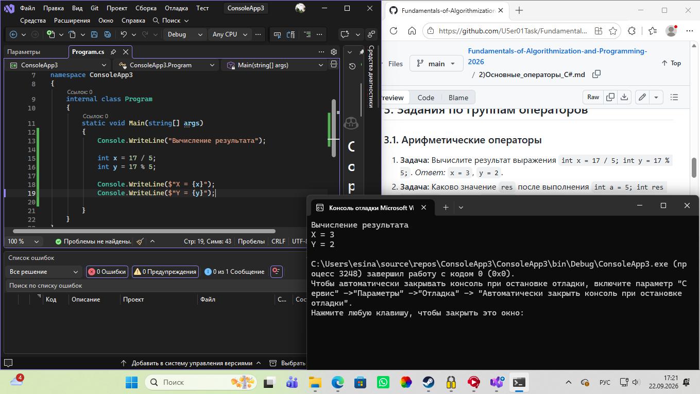 
</picture>


    using System;
    using System.Collections.Generic;
    using System.Linq;
    using System.Text;
    using System.Threading.Tasks;

    namespace ConsoleApp1
    {
    internal class Program
    {
        static void Main(string[] args)
        {

            Console.WriteLine("Вычисление результата");

            int x = 17 / 5;
            int y = 17 % 5;

            Console.WriteLine($"X = {x}");
            Console.WriteLine($"Y = {y}");

            
        }
    }
    }
### Задание 2: Каково значение res после выполнения int a = 5; int res = ++a * 2;? Ответ: res = 12 (префиксный инкремент увеличивает a до 6, затем умножение).
<picture> 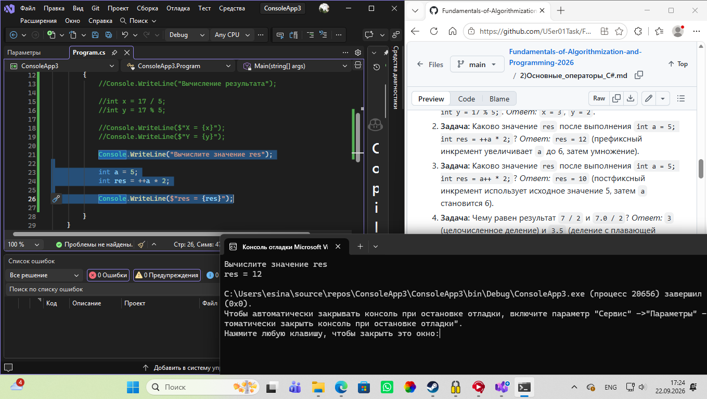 
</picture>


```csharp
using System;
using System.Collections.Generic;
using System.Linq;
using System.Text;
using System.Threading.Tasks;

namespace ConsoleApp1
{
    internal class Program
    {
        static void Main(string[] args)
        {
            int a = 5;
            int res = ++a * 2;
            Console.WriteLine($"{res}");
        }
    }
}
```

### Задание 3:Каково значение res после выполнения int a = 5; int res = a++ * 2;? Ответ: res = 10 (постфиксный инкремент использует исходное значение 5, затем a становится 6).

<picture> 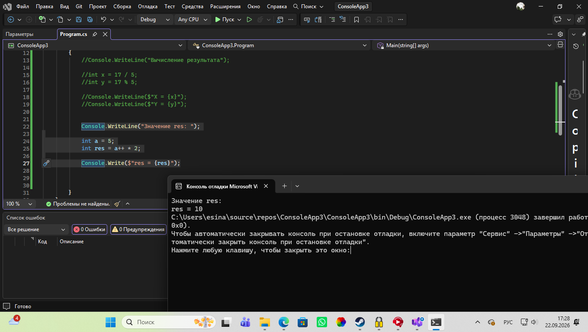 
</picture>

```csharp
using System;
using System.Collections.Generic;
using System.Linq;
using System.Text;
using System.Threading.Tasks;

namespace ConsoleApp1
{
    internal class Program
    {
        static void Main(string[] args)
        {
            int a = 5;
            int res = a++ * 2;
            Console.WriteLine($"{res}");
        }
    }
}
```

### Задание 4:Чему равен результат 7 / 2 и 7.0 / 2? Ответ: 3 (целочисленное деление) и 3.5 (деление с плавающей точкой).

<picture> 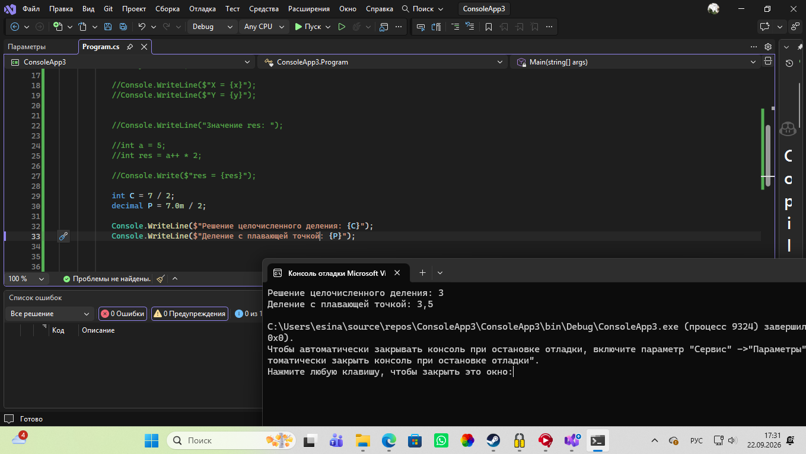 
</picture>

```csharp
using System;
using System.Collections.Generic;
using System.Linq;
using System.Text;
using System.Threading.Tasks;

namespace ConsoleApp1
{
    internal class Program
    {
        static void Main(string[] args)
        {
            int res1 = 7 / 2;
            double res2 = 7.0 / 2;
            Console.WriteLine($"{res1}, {res2}");
        }
    }
}
```

### Задание 5:Каков результат выражения -15 % 4 в C#? Ответ: -3 (знак остатка совпадает со знаком делимого).

<picture> 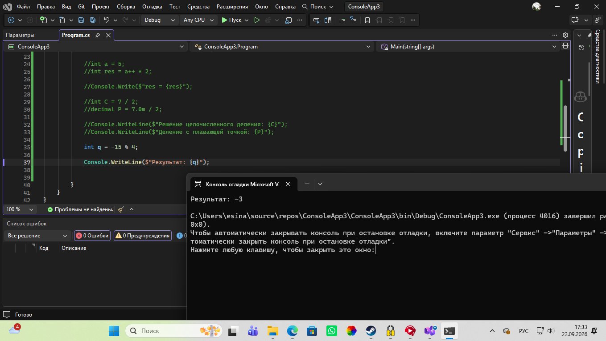 
</picture>

```csharp
using System;
using System.Collections.Generic;
using System.Linq;
using System.Text;
using System.Threading.Tasks;

namespace ConsoleApp1
{
    internal class Program
    {
        static void Main(string[] args)
        {
            int res = -15 % 4;
            Console.WriteLine($"{res}");
        }
    }
}
```

### Задание 6:Что выведет выражение int x = 10; x = x++ + ++x;? Ответ: 22 (первое слагаемое 10, после него x становится 11, префиксный инкремент делает x = 12, итог 
10
+
12
=

<picture> 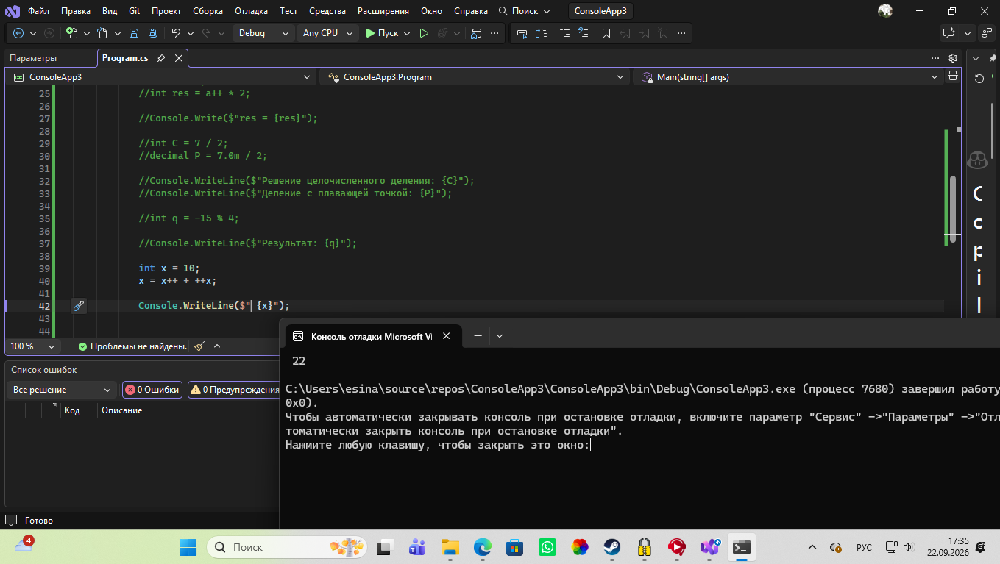 
</picture>

```csharp
using System;
using System.Collections.Generic;
using System.Linq;
using System.Text;
using System.Threading.Tasks;

namespace ConsoleApp1
{
    internal class Program
    {
        static void Main(string[] args)
        {
            int x = 10;
            x = x++ + ++x;
            Console.WriteLine($"{x}");
        }
    }
}
```

### Задание 7:Что произойдет при выполнении int max = int.MaxValue; int res = checked(max + 1);? Ответ: Выбросится исключение System.OverflowException.

<picture> 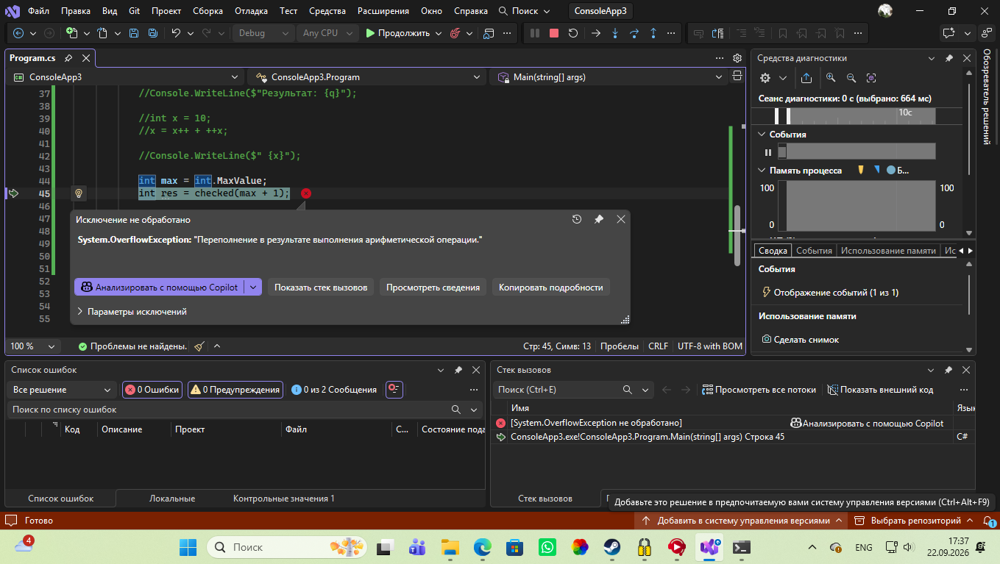 
</picture>

```csharp
using System;
using System.Collections.Generic;
using System.Linq;
using System.Text;
using System.Threading.Tasks;

namespace ConsoleApp1
{
    internal class Program
    {
        static void Main(string[] args)
        {
            int max = int.MaxValue;
            int res = checked(max + 1); // System.OverflowException
            Console.WriteLine($"{res}");
        }
    }
}
```

### Задание 8:Что произойдет при int max = int.MaxValue; int res = unchecked(max + 1);? Ответ: res = int.MinValue (произойдет переполнение без ошибки).

<picture> 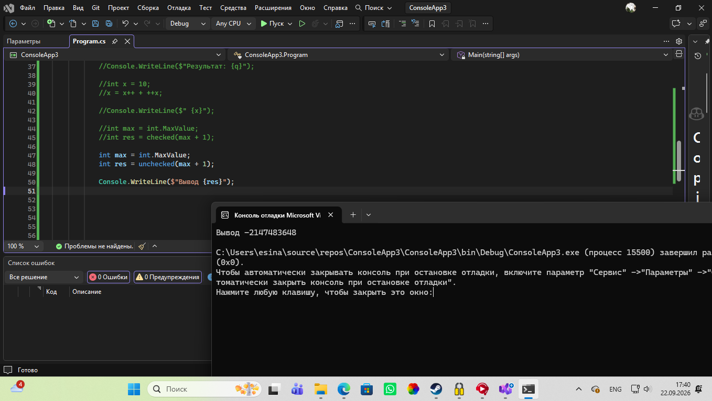 
</picture>

```csharp
using System;
using System.Collections.Generic;
using System.Linq;
using System.Text;
using System.Threading.Tasks;

namespace ConsoleApp1
{
    internal class Program
    {
        static void Main(string[] args)
        {
            int max = int.MaxValue;
            int res = unchecked(max + 1);
            Console.WriteLine($"{res}");
        }
    }
}
```

### Задание 9:Чему равен результат деления 1.0 / 0.0 и 0.0 / 0.0? Ответ: double.PositiveInfinity (Infinity) и double.NaN.

<picture> 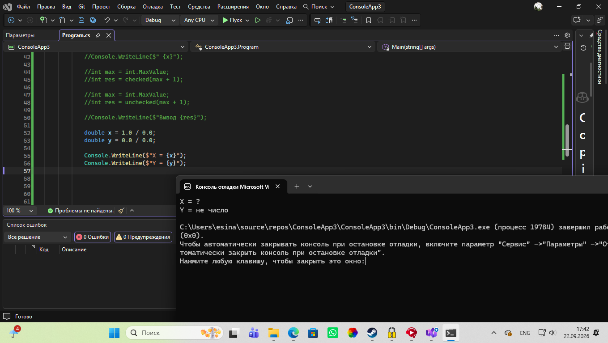 
</picture>

```csharp
using System;
using System.Collections.Generic;
using System.Linq;
using System.Text;
using System.Threading.Tasks;

namespace ConsoleApp1
{
    internal class Program
    {
        static void Main(string[] args)
        {
            double res1 = 1.0 / 0.0;
            double res2 = 0.0 / 0.0;
            Console.WriteLine($"{res1}, {res2}");
        }
    }
}
```

### Задание 10:Вычислите: int a = 8; int b = 3; int c = a - b * 2 + a / b;. Ответ: 8 - 6 + 2 = 4.

<picture> 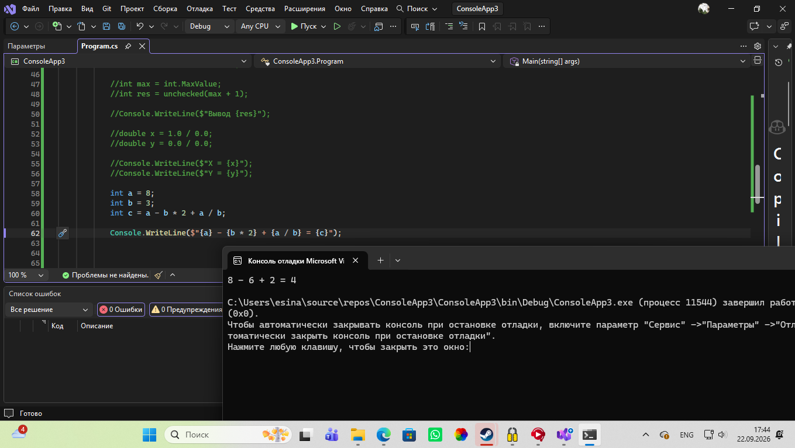 
</picture>

```csharp
using System;
using System.Collections.Generic;
using System.Linq;
using System.Text;
using System.Threading.Tasks;

namespace ConsoleApp1
{
    internal class Program
    {
        static void Main(string[] args)
        {
            int a = 8;
            int b = 3;
            int c = a - b * 2 + a / b;
            Console.WriteLine($"{c}");
        }
    }
}
```

## 3.2. Операторы сравнения и равенства

### Задание 1:Каков результат 5 > 3 и 5 >= 5? Ответ: true, true.

<picture> 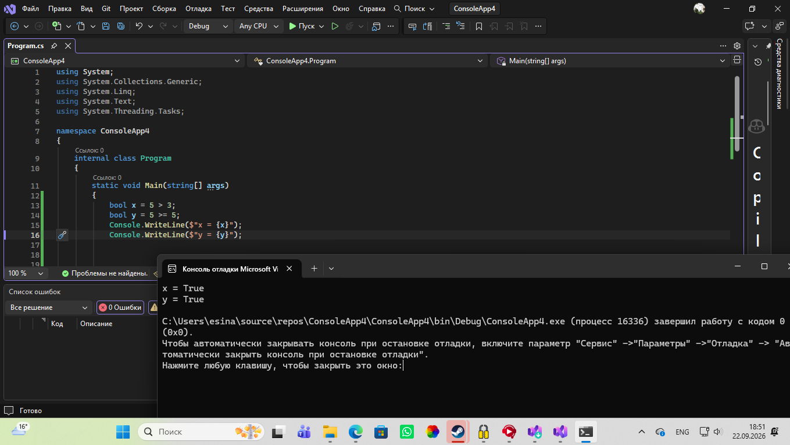 
</picture>

```csharp
using System;
using System.Collections.Generic;
using System.Linq;
using System.Text;
using System.Threading.Tasks;

namespace ConsoleApp1
{
    internal class Program
    {
        static void Main(string[] args)
        {
            bool r1 = 5 > 3;
            bool r2 = 5 >= 5;
            Console.WriteLine($"{r1}, {r2}");
        }
    }
}
```

### Задание 2:Чему равно "hello" == "hello" в C# и почему? Ответ: true, так как для типа string оператор == перегружен для посимвольного сравнения значений.

<picture> 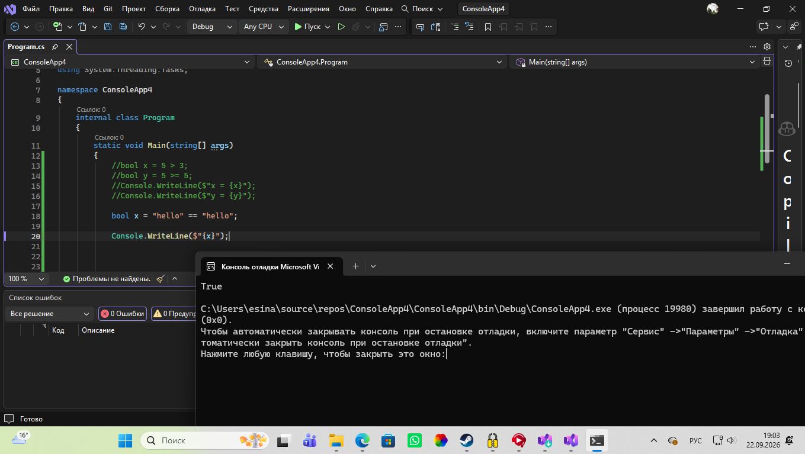 
</picture>

```csharp
using System;
using System.Collections.Generic;
using System.Linq;
using System.Text;
using System.Threading.Tasks;

namespace ConsoleApp1
{
    internal class Program
    {
        static void Main(string[] args)
        {
            bool res = "hello" == "hello";
            Console.WriteLine($"{res}");
        }
    }
}
```

### Задание 3:Чему равно выражение double.NaN == double.NaN? Ответ: false (по стандарту IEEE 754 NaN не равен ничему, даже самому себе).

<picture> 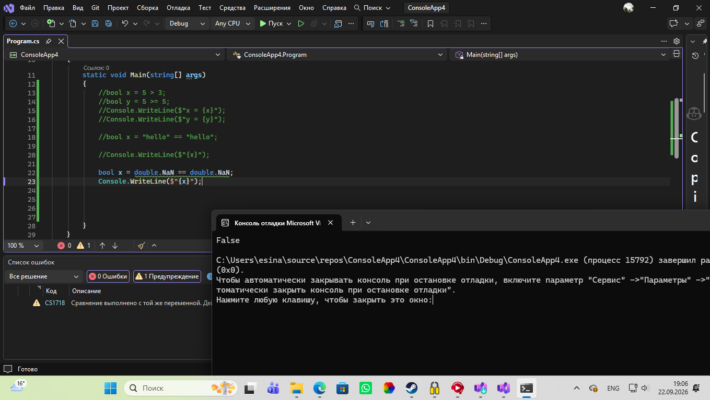 
</picture> 

```csharp
using System;
using System.Collections.Generic;
using System.Linq;
using System.Text;
using System.Threading.Tasks;

namespace ConsoleApp1
{
    internal class Program
    {
        static void Main(string[] args)
        {
            bool res = double.NaN == double.NaN;
            Console.WriteLine($"{res}");
        }
    }
}
```

### Задание 4:Каков результат выражения object a = new int[] { 1 }; object b = new int[] { 1 }; bool r = a == b;? Ответ: false (сравниваются ссылки на два разных объекта в куче).

<picture> 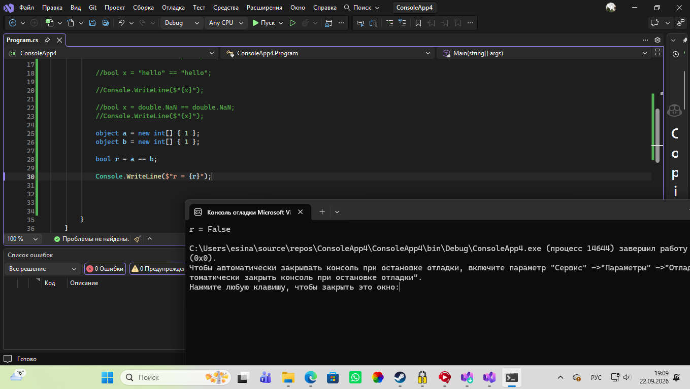 
</picture>

```csharp
using System;
using System.Collections.Generic;
using System.Linq;
using System.Text;
using System.Threading.Tasks;

namespace ConsoleApp1
{
    internal class Program
    {
        static void Main(string[] args)
        {
            object a = new int[] { 1 };
            object b = new int[] { 1 };
            bool r = a == b;
            Console.WriteLine($"{r}");
        }
    }
}
```

### Задание 5:Чему равно 10 != 10.0? Ответ: false (целое число 10 неявно приводится к 10.0, значения равны).

<picture> 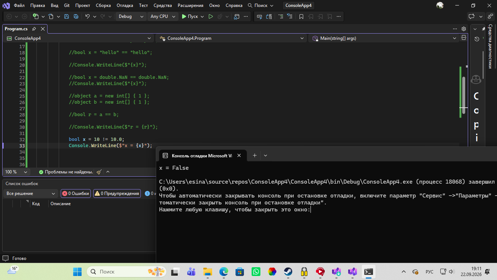 
</picture>

```csharp
using System;
using System.Collections.Generic;
using System.Linq;
using System.Text;
using System.Threading.Tasks;

namespace ConsoleApp1
{
    internal class Program
    {
        static void Main(string[] args)
        {
            bool res = 10 != 10.0;
            Console.WriteLine($"{res}");
        }
    }
}
```

### Задание 6:Что вернет null == null? Ответ: true.

<picture> 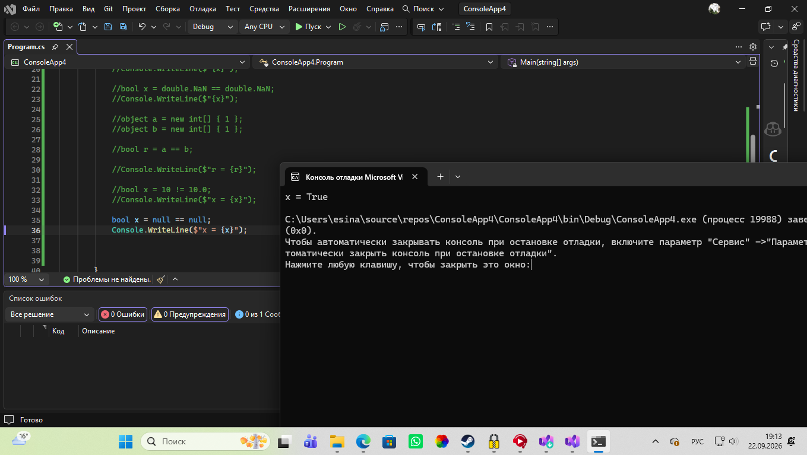 
</picture>

```csharp
using System;
using System.Collections.Generic;
using System.Linq;
using System.Text;
using System.Threading.Tasks;

namespace ConsoleApp1
{
    internal class Program
    {
        static void Main(string[] args)
        {
            bool res = null == null;
            Console.WriteLine($"{res}");
        }
    }
}
```

### Задание 7:Каков результат выражения (3 < 5) == (10 >= 20)? Ответ: false (true == false дает false).

<picture> 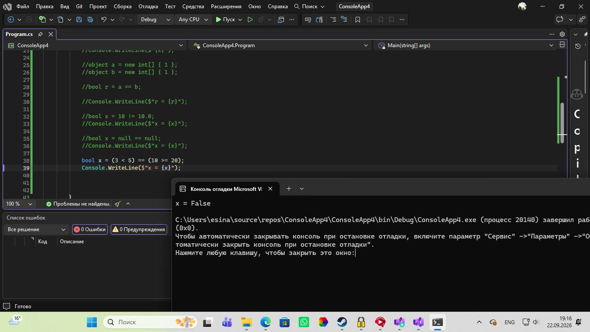 
</picture>

```csharp
using System;
using System.Collections.Generic;
using System.Linq;
using System.Text;
using System.Threading.Tasks;

namespace ConsoleApp1
{
    internal class Program
    {
        static void Main(string[] args)
        {
            bool res = (3 < 5) == (10 >= 20);
            Console.WriteLine($"{res}");
        }
    }
}
```

### Задание 8:Вычислите bool res = 4 <= 4 && 5 > 2;. Ответ: true.

<picture> 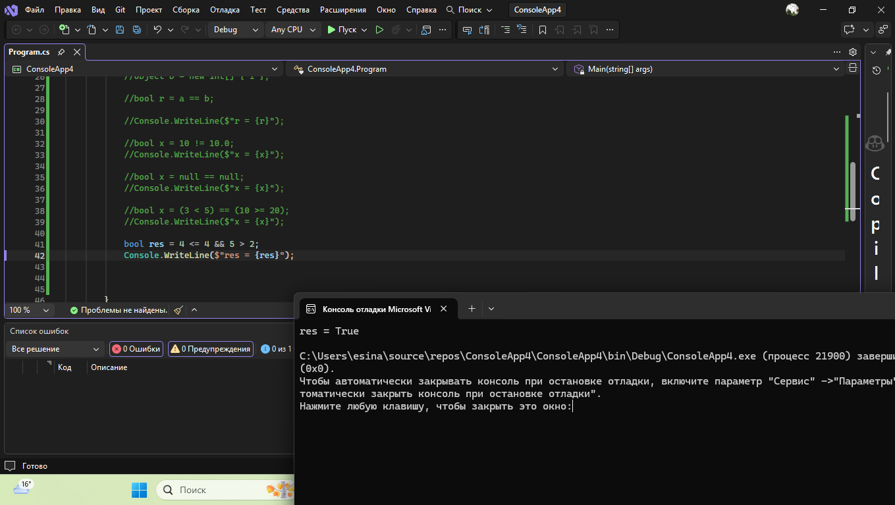 
</picture>

```csharp
using System;
using System.Collections.Generic;
using System.Linq;
using System.Text;
using System.Threading.Tasks;

namespace ConsoleApp1
{
    internal class Program
    {
        static void Main(string[] args)
        {
            bool res = 4 <= 4 && 5 > 2;
            Console.WriteLine($"{res}");
        }
    }
}
```

### Задание 9:Что вернет выражение char c = 'b'; bool res = c > 'a';? Ответ: true (символы сравниваются по их числовым кодам Unicode: 98 > 97).

<picture> 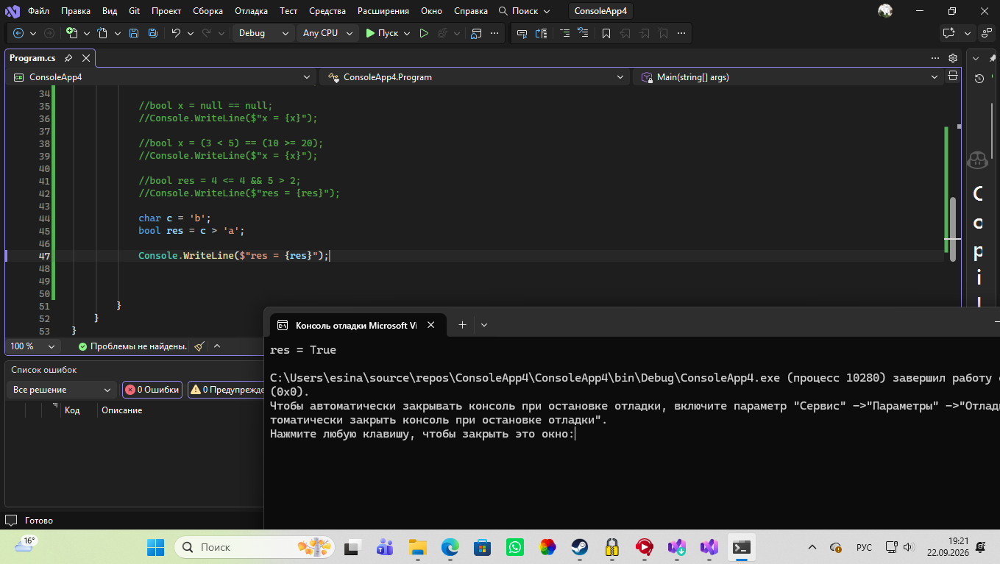 
</picture>

```csharp
using System;
using System.Collections.Generic;
using System.Linq;
using System.Text;
using System.Threading.Tasks;

namespace ConsoleApp1
{
    internal class Program
    {
        static void Main(string[] args)
        {
            char c = 'b';
            bool res = c > 'a';
            Console.WriteLine($"{res}");
        }
    }
}
```

### Задание 10:Сравните результат bool r = -0.0 == 0.0;. Ответ: true (ноль со знаком равен обычному нулю).


<picture> 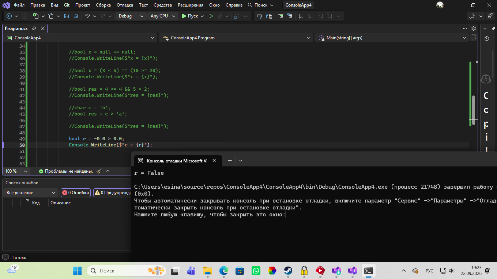 
</picture>

```csharp
using System;
using System.Collections.Generic;
using System.Linq;
using System.Text;
using System.Threading.Tasks;

namespace ConsoleApp1
{
    internal class Program
    {
        static void Main(string[] args)
        {
            bool r = -0.0 == 0.0;
            Console.WriteLine($"{r}");
        }
    }
}
```

## 3.3. Логические операторы

### Задание 1:Вычислите: !true || false && true. Ответ: false (приоритет: ! -> && -> ||: false || false дает false).

<picture> 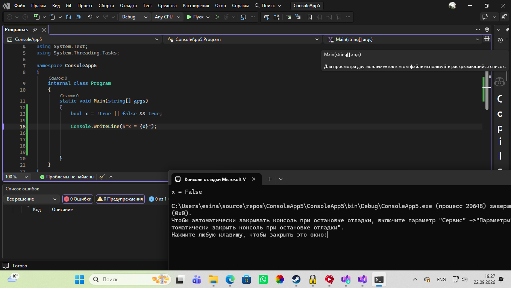 
</picture>

```csharp
using System;
using System.Collections.Generic;
using System.Linq;
using System.Text;
using System.Threading.Tasks;

namespace ConsoleApp1
{
    internal class Program
    {
        static void Main(string[] args)
        {
            bool res = !true || false && true;
            Console.WriteLine($"{res}");
        }
    }
}
```

### Задание 2:Будет ли вызван метод Foo() в false && Foo()? Ответ: Нет, благодаря короткому замыканию оператора &&.

<picture> 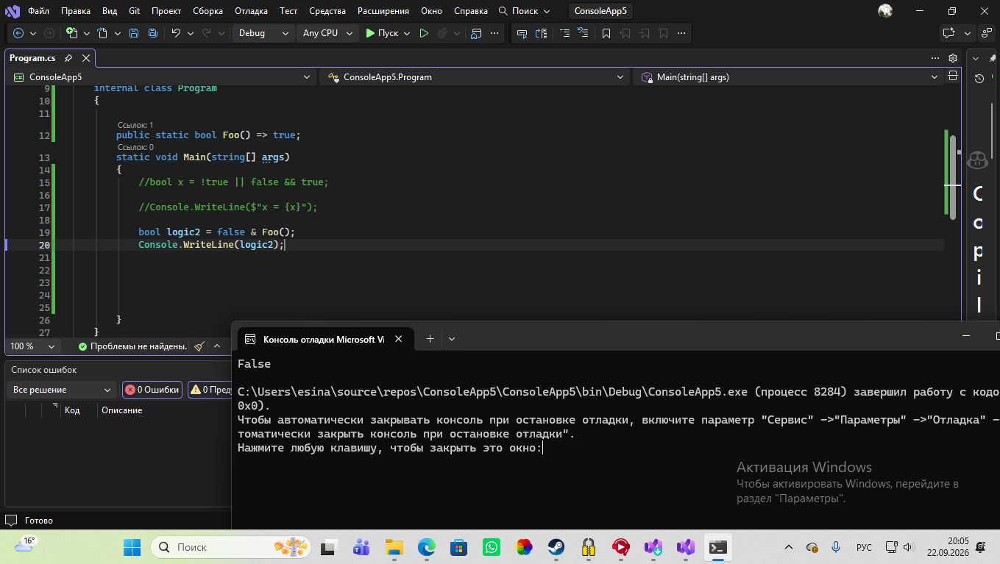 
</picture>

```csharp
using System;
using System.Collections.Generic;
using System.Linq;
using System.Text;
using System.Threading.Tasks;

namespace ConsoleApp1
{
    internal class Program
    {
        static void Main(string[] args)
        {
            static bool Foo()
            {
                Console.WriteLine("Foo вызван");
                return true;
            }

            bool res = false && Foo(); // Foo() не вызывается
            Console.WriteLine($"{res}");
        }
    }
}
```

### Задание 3:Будет ли вызван метод Foo() в false & Foo()? Ответ: Да, побитовое/строгое логическое & вычисляет оба операнда.

<picture> 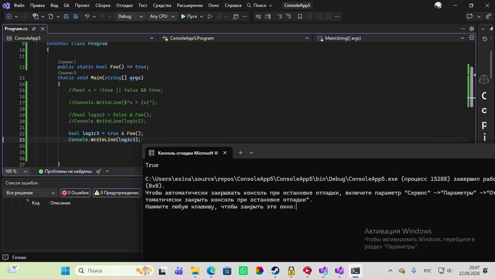 
</picture>

```csharp
using System;
using System.Collections.Generic;
using System.Linq;
using System.Text;
using System.Threading.Tasks;

namespace ConsoleApp1
{
    internal class Program
    {
        static void Main(string[] args)
        {
            bool res = false & Foo(); // Foo() вызывается
            Console.WriteLine($"{res}");
        }
    }
}
```

### Задание 4:Вычислите результат: true ^ false ^ true. Ответ: false (true ^ false = true, затем true ^ true = false).

<picture> 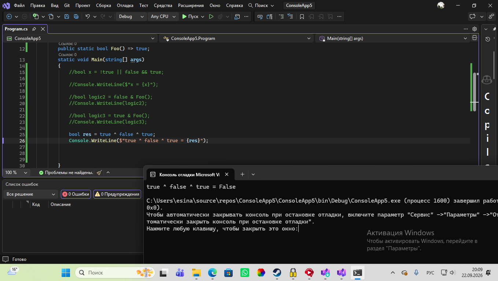 
</picture>

```csharp
using System;
using System.Collections.Generic;
using System.Linq;
using System.Text;
using System.Threading.Tasks;

namespace ConsoleApp1
{
    internal class Program
    {
        static void Main(string[] args)
        {
            bool res = true ^ false ^ true;
            Console.WriteLine($"{res}");
        }
    }
}
```

### Задание 5:Что вернет выражение !(5 > 2 || 3 < 1)? Ответ: false (5 > 2 истинно, внутри скобок true, отрицание дает false).

<picture> 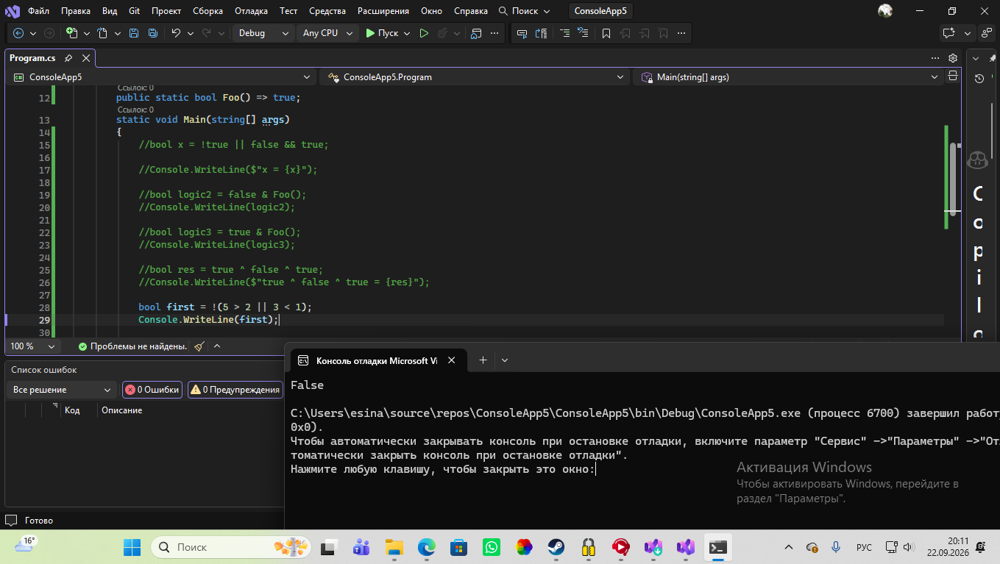 
</picture>

```csharp
using System;
using System.Collections.Generic;
using System.Linq;
using System.Text;
using System.Threading.Tasks;

namespace ConsoleApp1
{
    internal class Program
    {
        static void Main(string[] args)
        {
            bool res = !(5 > 2 || 3 < 1);
            Console.WriteLine($"{res}");
        }
    }
}
```

### Задание 6:Дано: bool a = true, b = false;. Чему равно a && !b || b && !a? Ответ: true (true && true || false && false -> true || false -> true).

<picture> 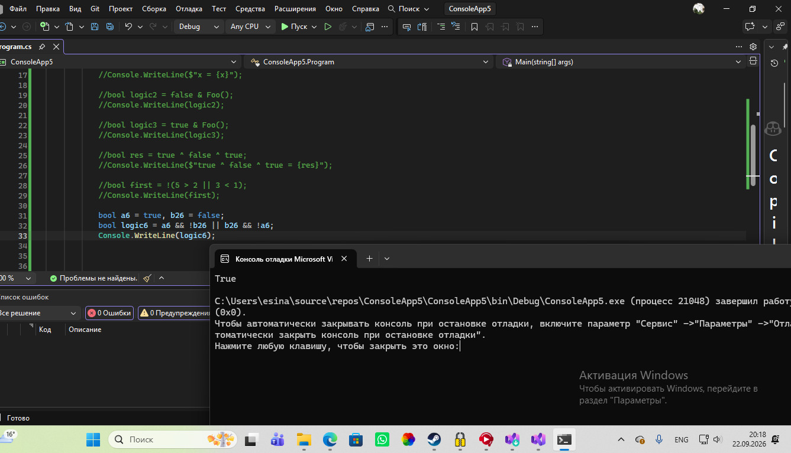 
</picture>

```csharp
using System;
using System.Collections.Generic;
using System.Linq;
using System.Text;
using System.Threading.Tasks;

namespace ConsoleApp1
{
    internal class Program
    {
        static void Main(string[] args)
        {
            bool a = true, b = false;
            bool res = a && !b || b && !a;
            Console.WriteLine($"{res}");
        }
    }
}
```

### Задание 7:Каков результат true || (x / 0 == 1) при любом целом x? Ответ: true (деление на ноль не произойдет из-за короткого замыкания ||).

<picture> 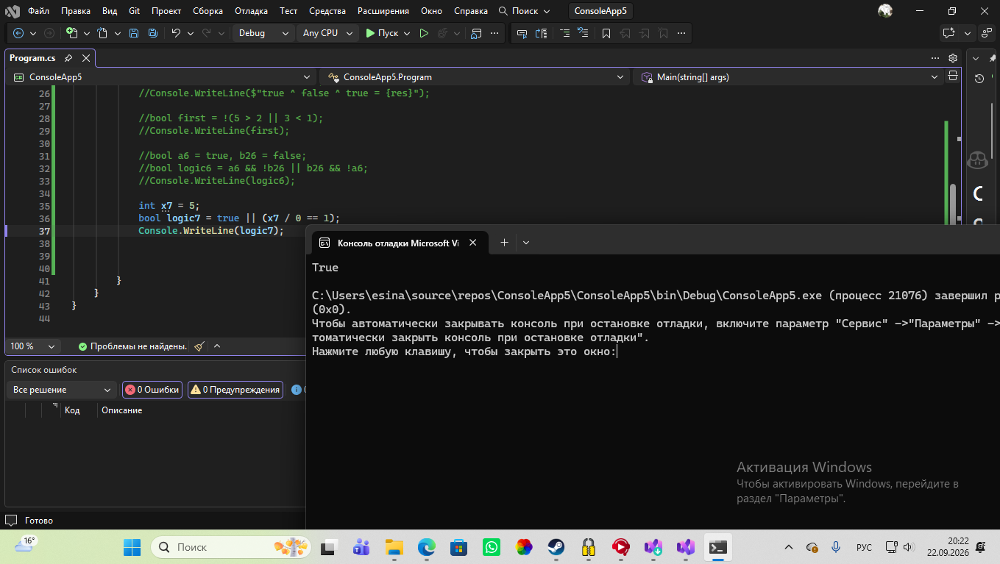 
</picture>

```csharp
using System;
using System.Collections.Generic;
using System.Linq;
using System.Text;
using System.Threading.Tasks;

namespace ConsoleApp1
{
    internal class Program
    {
        static void Main(string[] args)
        {
            int x = 5;
            bool res = true || (x / 0 == 1); // деление не произойдет
            Console.WriteLine($"{res}");
        }
    }
}
```

### Задание 8:Каков результат false & (10 / 0 == 1)? Ответ: Выбросится исключение DivideByZeroException, так как & обязательно вычисляет правый операнд.

<picture> 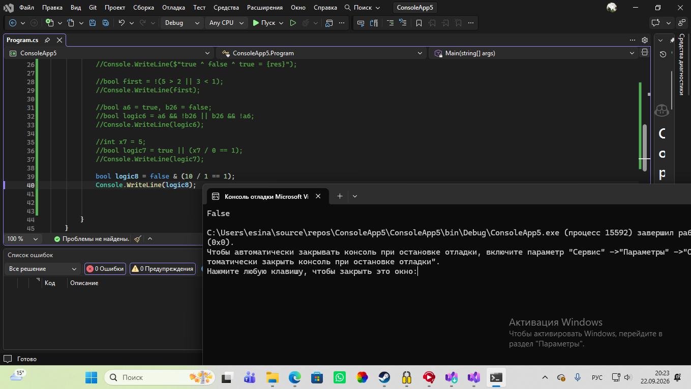 
</picture>

```csharp
using System;
using System.Collections.Generic;
using System.Linq;
using System.Text;
using System.Threading.Tasks;

namespace ConsoleApp1
{
    internal class Program
    {
        static void Main(string[] args)
        {
            try
            {
                bool res = false & (10 / 0 == 1); // DivideByZeroException
                Console.WriteLine($"{res}");
            }
            catch (DivideByZeroException)
            {
                Console.WriteLine("DivideByZeroException");
            }
        }
    }
}
```

### Задание 9:Чему эквивалентно выражение !(A && B) по закону де Моргана? Ответ: !A || !B.

<picture> 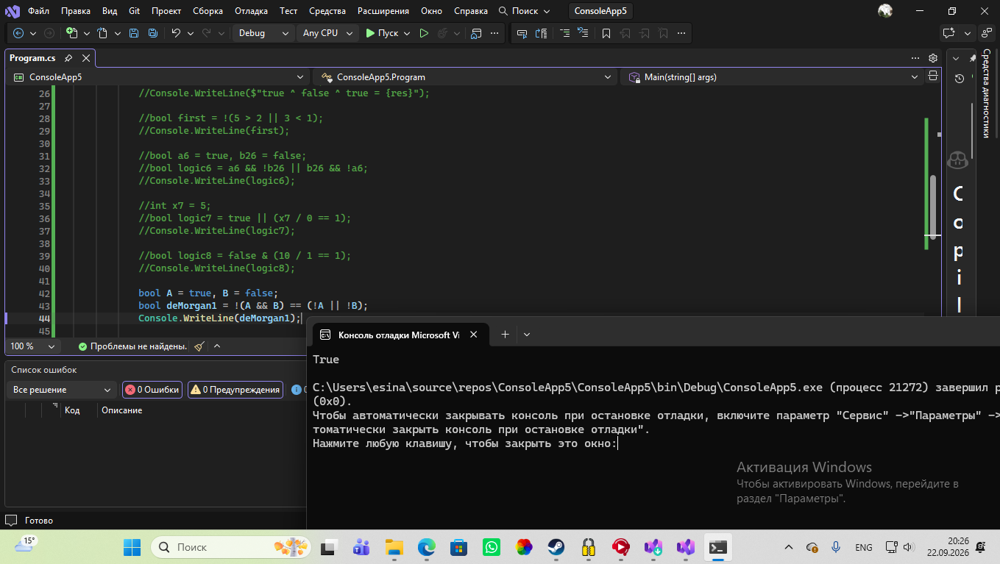 
</picture>

```csharp
using System;
using System.Collections.Generic;
using System.Linq;
using System.Text;
using System.Threading.Tasks;

namespace ConsoleApp1
{
    internal class Program
    {
        static void Main(string[] args)
        {
            bool A = true, B = false;
            bool deMorgan1 = !(A && B);
            bool deMorgan1Equivalent = !A || !B;
            Console.WriteLine($"{deMorgan1}, {deMorgan1Equivalent}");
        }
    }
}
```

### Задание 10:Чему эквивалентно выражение !(A || B) по закону де Моргана? Ответ: !A && !B.


<picture> 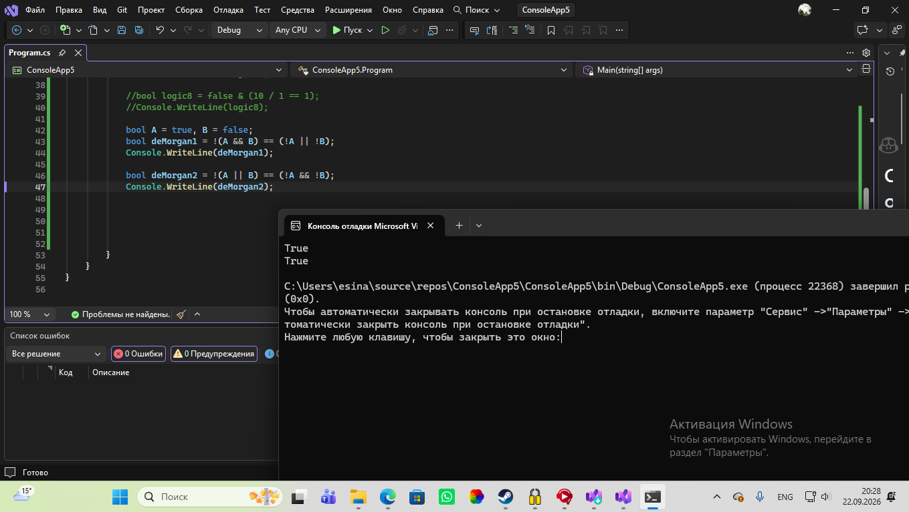 
</picture>

```csharp
using System;
using System.Collections.Generic;
using System.Linq;
using System.Text;
using System.Threading.Tasks;

namespace ConsoleApp1
{
    internal class Program
    {
        static void Main(string[] args)
        {
            bool A = true, B = false;
            bool deMorgan2 = !(A || B);
            bool deMorgan2Equivalent = !A && !B;
            Console.WriteLine($"{deMorgan2}, {deMorgan2Equivalent}");
        }
    }
}
```


## 3.4. Побитовые операторы и сдвиги

### Задание 1:Чему равен результат 5 & 3 в двоичном и десятичном виде? Ответ: 0101 & 0011 = 0001 (десятичное 1).

<picture> 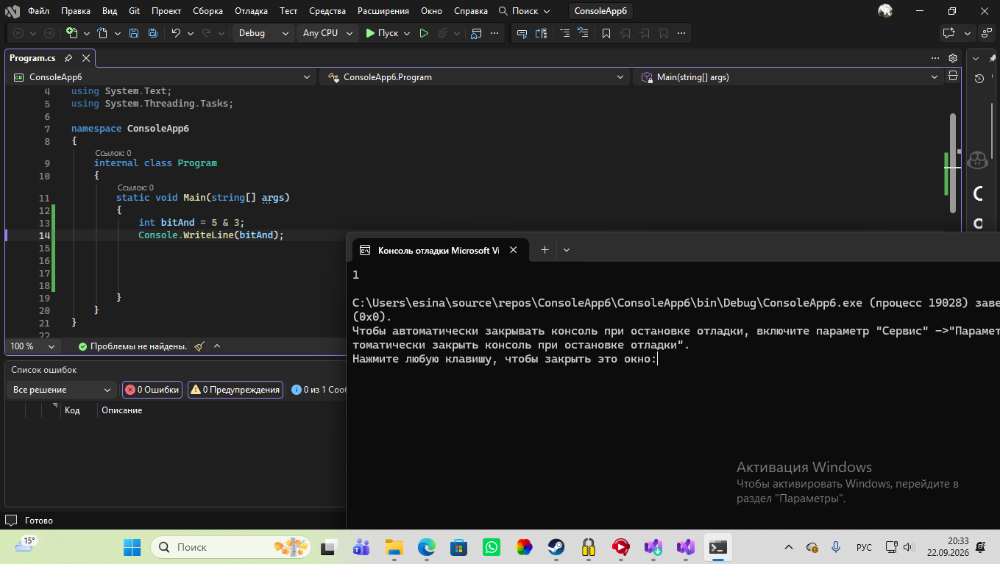 
</picture>

```csharp
using System;
using System.Collections.Generic;
using System.Linq;
using System.Text;
using System.Threading.Tasks;

namespace ConsoleApp1
{
    internal class Program
    {
        static void Main(string[] args)
        {
            int res = 5 & 3;
            Console.WriteLine($"{res}");
        }
    }
}
```

### Задание 2:Чему равен результат 5 | 3? Ответ: 0101 | 0011 = 0111 (десятичное 7).

<picture> 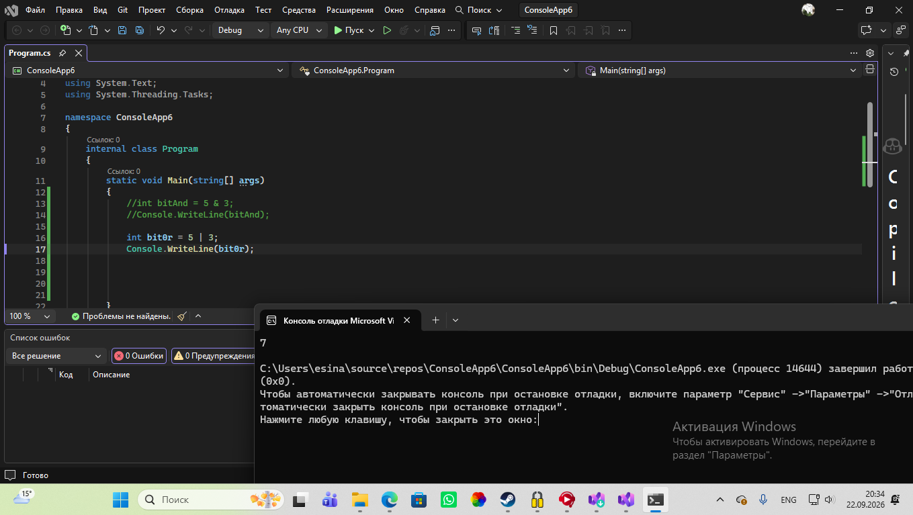 
</picture>

```csharp
using System;
using System.Collections.Generic;
using System.Linq;
using System.Text;
using System.Threading.Tasks;

namespace ConsoleApp1
{
    internal class Program
    {
        static void Main(string[] args)
        {
            int res = 5 | 3;
            Console.WriteLine($"{res}");
        }
    }
}
```

### Задание 3:Чему равен результат 5 ^ 3? Ответ: 0101 ^ 0011 = 0110 (десятичное 6).

<picture> 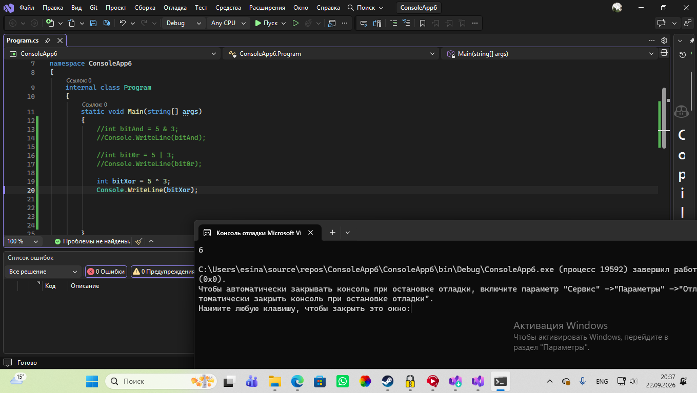 
</picture>

```csharp
using System;
using System.Collections.Generic;
using System.Linq;
using System.Text;
using System.Threading.Tasks;

namespace ConsoleApp1
{
    internal class Program
    {
        static void Main(string[] args)
        {
            int res = 5 ^ 3;
            Console.WriteLine($"{res}");
        }
    }
}
```

### Задание 4:Вычислите ~0 для типа int. Ответ: -1 (все биты устанавливаются в 1, что в дополнительном коде равно -1).

<picture> 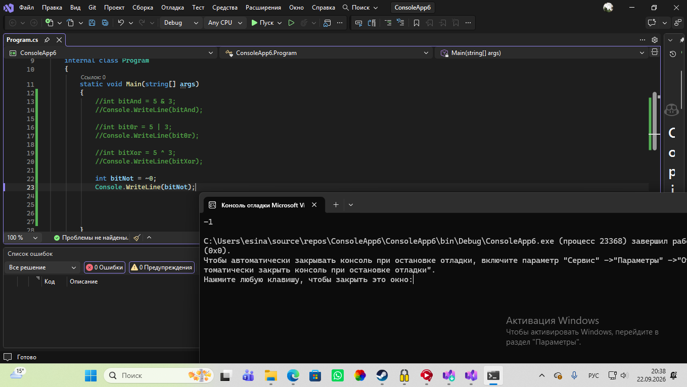 
</picture>

```csharp
using System;
using System.Collections.Generic;
using System.Linq;
using System.Text;
using System.Threading.Tasks;

namespace ConsoleApp1
{
    internal class Program
    {
        static void Main(string[] args)
        {
            int res = ~0;
            Console.WriteLine($"{res}");
        }
    }
}
```

### Задание 5:Чему равно 1 << 4? Ответ: 16

<picture> 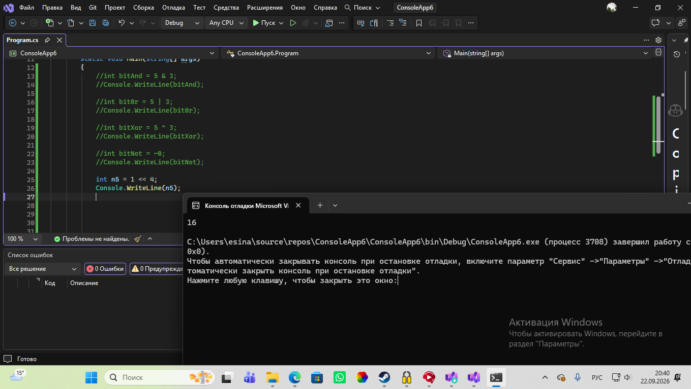 
</picture>

```csharp
using System;
using System.Collections.Generic;
using System.Linq;
using System.Text;
using System.Threading.Tasks;

namespace ConsoleApp1
{
    internal class Program
    {
        static void Main(string[] args)
        {
            int res = 1 << 4;
            Console.WriteLine($"{res}");
        }
    }
}
```

### Задание 6:Чему равно 40 >> 2? Ответ: 10

<picture> 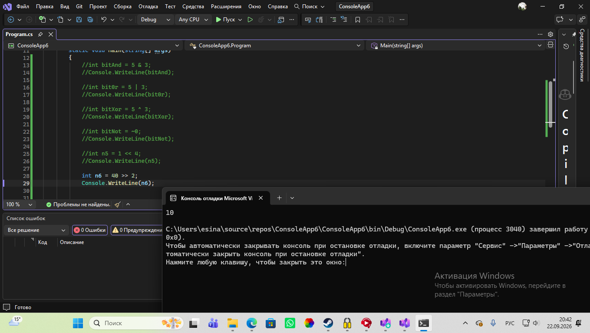 
</picture>

```csharp
using System;
using System.Collections.Generic;
using System.Linq;
using System.Text;
using System.Threading.Tasks;

namespace ConsoleApp1
{
    internal class Program
    {
        static void Main(string[] args)
        {
            int res = 40 >> 2;
            Console.WriteLine($"{res}");
        }
    }
}
```

### Задание 7: Как с помощью побитовой операции проверить, установлен ли третий бит числа n (маска 
2
3
=

<picture> 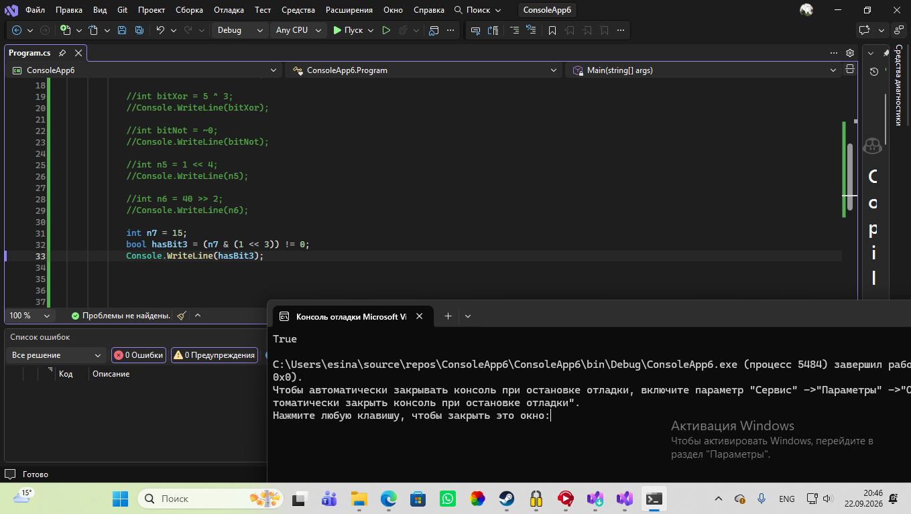 
</picture>

```csharp
using System;
using System.Collections.Generic;
using System.Linq;
using System.Text;
using System.Threading.Tasks;

namespace ConsoleApp1
{
    internal class Program
    {
        static void Main(string[] args)
        {
            int n = 8; // 1000
            bool bitSet = (n & 8) != 0; // или (n & (1 << 3)) != 0
            Console.WriteLine($"{bitSet}");
        }
    }
}
```

### Задание 8:Как с помощью побитовой операции установить 2-й бит числа n в 1? Ответ: n = n | (1 << 2); (или n |= (1 << 2);).

<picture> 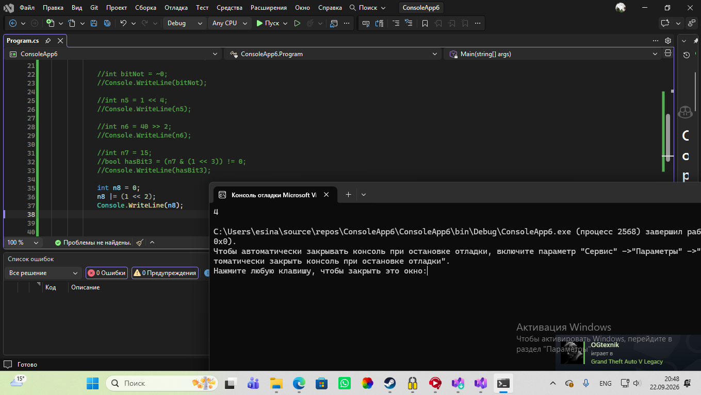 
</picture>

```csharp
using System;
using System.Collections.Generic;
using System.Linq;
using System.Text;
using System.Threading.Tasks;

namespace ConsoleApp1
{
    internal class Program
    {
        static void Main(string[] args)
        {
            int n = 0;
            n = n | (1 << 2); // n |= (1 << 2);
            Console.WriteLine($"{n}");
        }
    }
}
```

### Задание 9:Как сбросить (установить в 0) 4-й бит числа n? Ответ: n = n & ~(1 << 4); (или n &= ~(1 << 4);).

<picture> 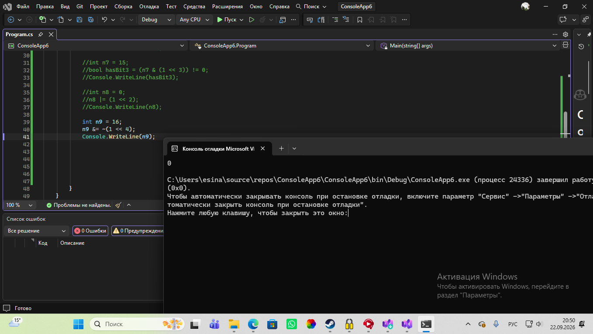 
</picture>

```csharp
using System;
using System.Collections.Generic;
using System.Linq;
using System.Text;
using System.Threading.Tasks;

namespace ConsoleApp1
{
    internal class Program
    {
        static void Main(string[] args)
        {
            int n = 16;
            n = n & ~(1 << 4); // n &= ~(1 << 4);
            Console.WriteLine($"{n}");
        }
    }
}
```

### Задание 10:Каков результат выражения (-16) >> 2 для int? Ответ: -4 (арифметический сдвиг вправо сохраняет знаковый бит 1).

<picture> 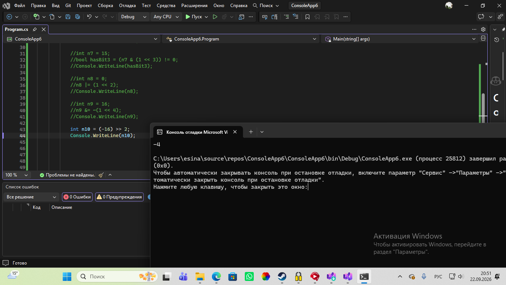 
</picture>

```csharp
using System;
using System.Collections.Generic;
using System.Linq;
using System.Text;
using System.Threading.Tasks;

namespace ConsoleApp1
{
    internal class Program
    {
        static void Main(string[] args)
        {
            int res = (-16) >> 2;
            Console.WriteLine($"{res}");
        }
    }
}
```

## 3.5. Операторы присваивания

### Задание 1:Что делает оператор x += 5? Ответ: Эквивалентен x = x + 5 (с приведением типа при необходимости).

<picture> 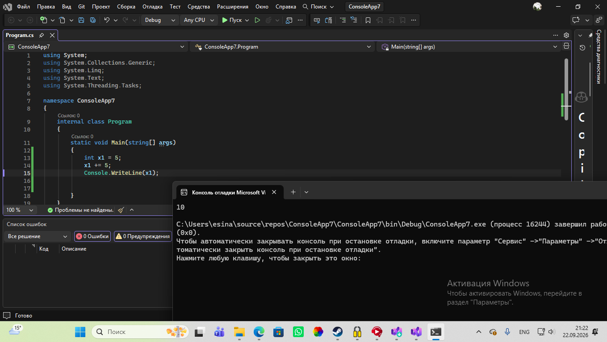 
</picture>

```csharp
using System;
using System.Collections.Generic;
using System.Linq;
using System.Text;
using System.Threading.Tasks;

namespace ConsoleApp1
{
    internal class Program
    {
        static void Main(string[] args)
        {
            int x = 10;
            x += 5; // эквивалентно x = x + 5
            Console.WriteLine($"{x}");
        }
    }
}
```

### Задание 2:Каково значение a после выполнения: int a = 10; a *= 2 + 3;? Ответ: 50 (правая часть вычисляется полностью перед умножением: a = a * (2 + 3)).

<picture>  
</picture>

```csharp
using System;
using System.Collections.Generic;
using System.Linq;
using System.Text;
using System.Threading.Tasks;

namespace ConsoleApp1
{
    internal class Program
    {
        static void Main(string[] args)
        {
            int a = 10;
            a *= 2 + 3; // a = a * (2 + 3)
            Console.WriteLine($"{a}");
        }
    }
}
```

### Задание 3:Чему равен x после int x = 12; x >>= 2;? Ответ: 3.

<picture> 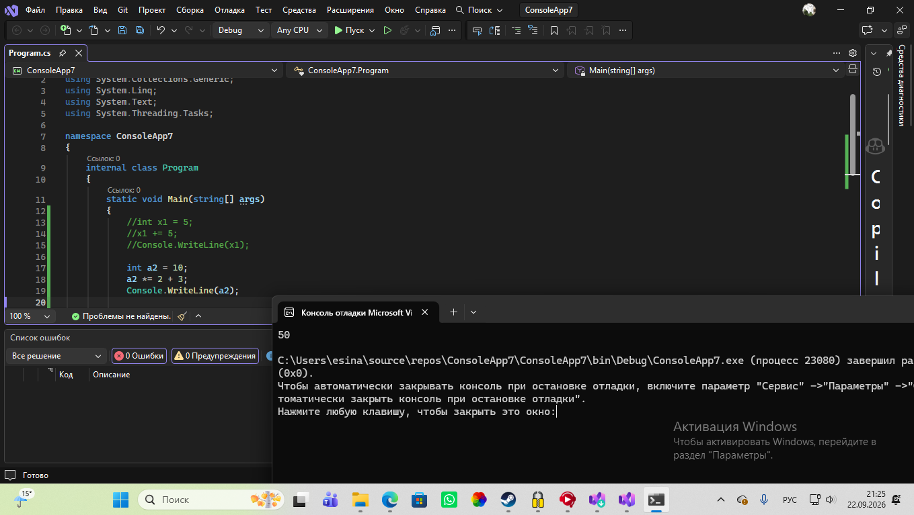 
</picture>

```csharp
using System;
using System.Collections.Generic;
using System.Linq;
using System.Text;
using System.Threading.Tasks;

namespace ConsoleApp1
{
    internal class Program
    {
        static void Main(string[] args)
        {
            int x = 12;
            x >>= 2;
            Console.WriteLine($"{x}");
        }
    }
}
```

### Задание 4:Что делает оператор x ??= y? Ответ: Присваивает переменной x значение y только в том случае, если x == null.

<picture> 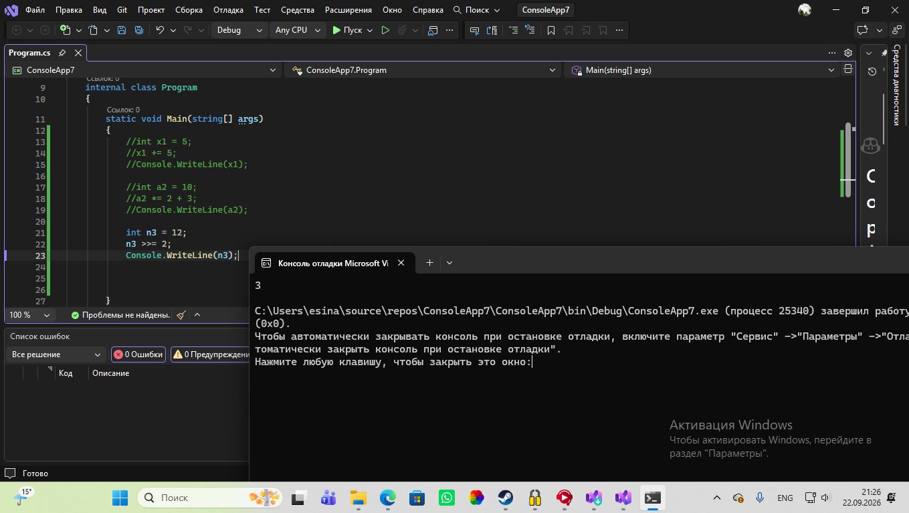 
</picture>

```csharp
using System;
using System.Collections.Generic;
using System.Linq;
using System.Text;
using System.Threading.Tasks;

namespace ConsoleApp1
{
    internal class Program
    {
        static void Main(string[] args)
        {
            int? x = null;
            int y = 5;
            x ??= y; // присвоит y, только если x == null
            Console.WriteLine($"{x}");
        }
    }
}
```

### Задание 5:Чему будет равна строка str после:

<picture> 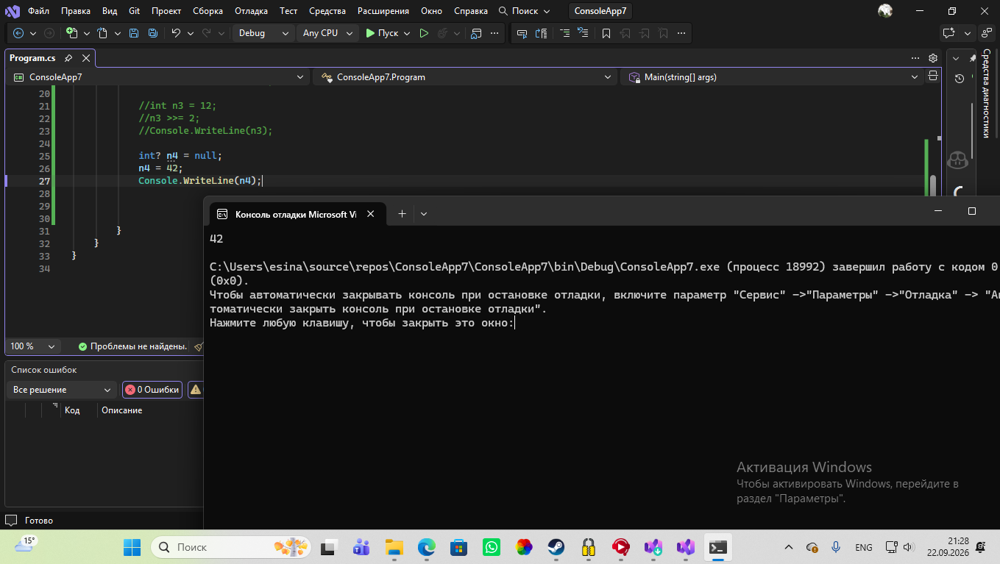 
</picture>

```csharp
using System;
using System.Collections.Generic;
using System.Linq;
using System.Text;
using System.Threading.Tasks;

namespace ConsoleApp1
{
    internal class Program
    {
        static void Main(string[] args)
        {
            string str = null;
            str ??= "default";
            str ??= "custom";
            Console.WriteLine($"{str}");
        }
    }
}
```

### Задание 6:Допустимо ли выражение byte b = 1; b += 2; без явного приведения? Ответ: Да, составные операторы присваивания содержат неявное сужающее приведение типа: b = (byte)(b + 2).

<picture> 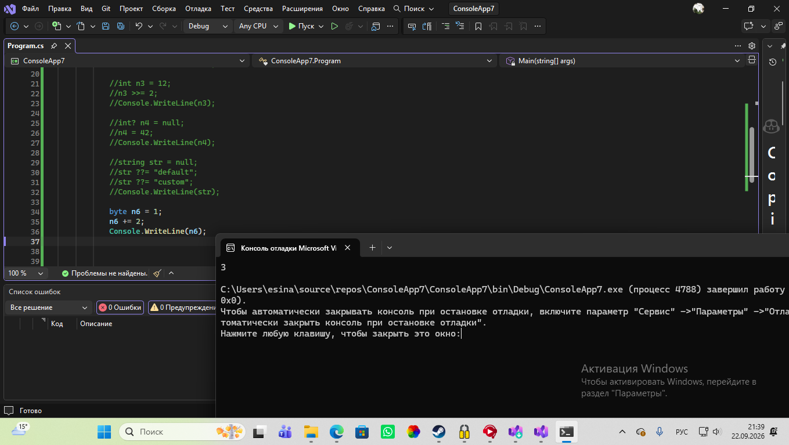 
</picture>

```csharp
using System;
using System.Collections.Generic;
using System.Linq;
using System.Text;
using System.Threading.Tasks;

namespace ConsoleApp1
{
    internal class Program
    {
        static void Main(string[] args)
        {
            byte b = 1;
            b += 2; // b = (byte)(b + 2)
            Console.WriteLine($"{b}");
        }
    }
}
```

### Задание 7:Чему равно значение c после int a = 5, b = 10, c = 0; c = a = b;? Ответ: 10 (присваивание ассоциативно справа налево).

<picture> 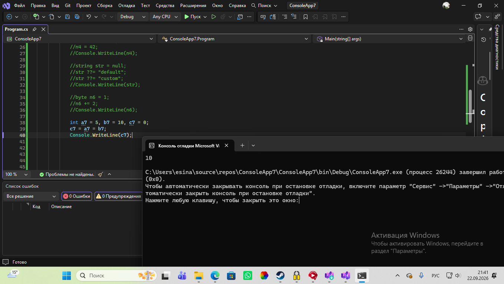 
</picture>

```csharp
using System;
using System.Collections.Generic;
using System.Linq;
using System.Text;
using System.Threading.Tasks;

namespace ConsoleApp1
{
    internal class Program
    {
        static void Main(string[] args)
        {
            int a = 5, b = 10, c = 0;
            c = a = b; // присваивание ассоциативно справа налево
            Console.WriteLine($"{c}, {a}");
        }
    }
}
```

### Задание 8:Каково значение mask после: int mask = 1; mask <<= 3; mask |= 2;? Ответ: 10 (1 << 3 = 8, затем 8 | 2 = 10).

<picture> 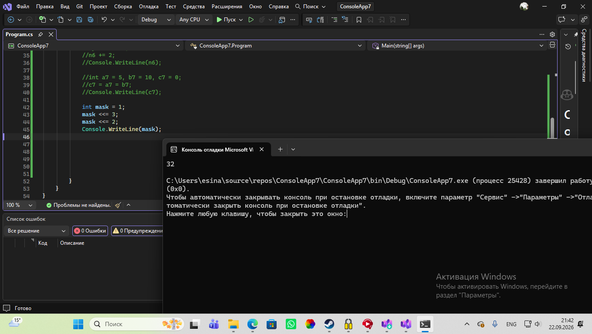 
</picture>

```csharp
using System;
using System.Collections.Generic;
using System.Linq;
using System.Text;
using System.Threading.Tasks;

namespace ConsoleApp1
{
    internal class Program
    {
        static void Main(string[] args)
        {
            int mask = 1;
            mask <<= 3; // mask = 8
            mask |= 2;  // mask = 10
            Console.WriteLine($"{mask}");
        }
    }
}
```

### Задание 9:Чему равно x после int x = 15; x %= 4;? Ответ: 3.

<picture> 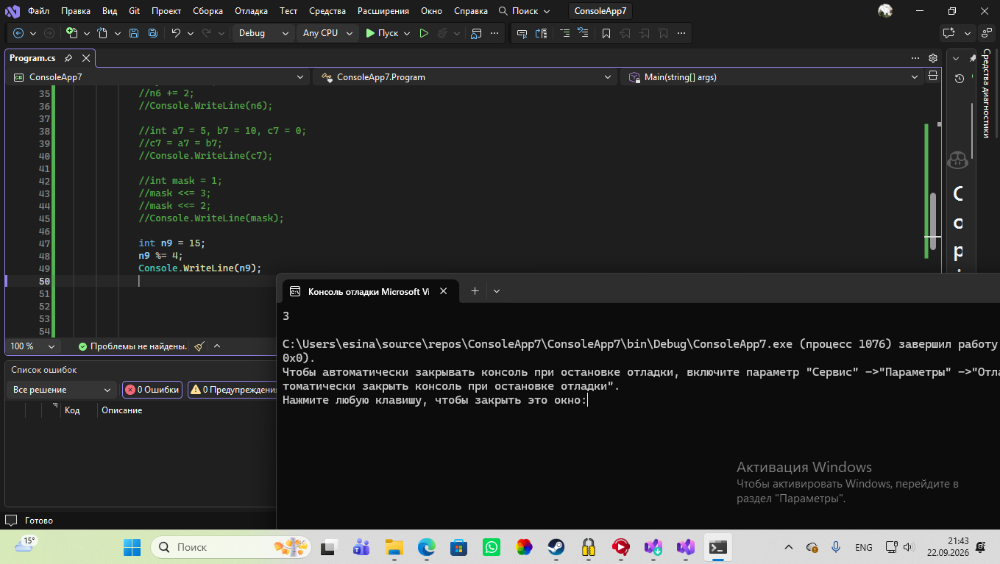 
</picture>

```csharp
using System;
using System.Collections.Generic;
using System.Linq;
using System.Text;
using System.Threading.Tasks;

namespace ConsoleApp1
{
    internal class Program
    {
        static void Main(string[] args)
        {
            int x = 15;
            x %= 4;
            Console.WriteLine($"{x}");
        }
    }
}
```

### Задание 10:Чему равно x после int x = 7; x ^= 7;? Ответ: 0 (любое число XOR само с собой дает 0).

<picture> 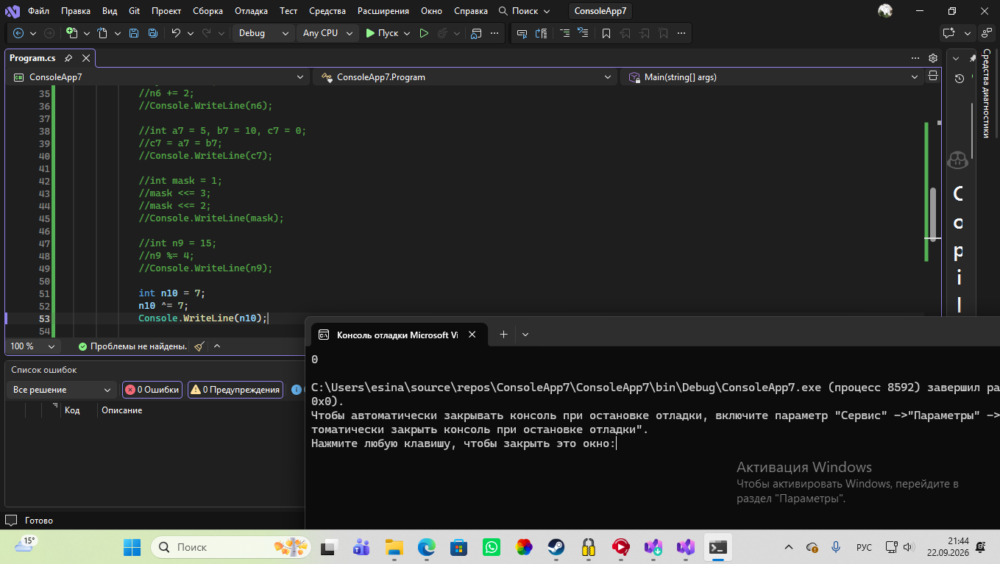 
</picture>

```csharp
using System;
using System.Collections.Generic;
using System.Linq;
using System.Text;
using System.Threading.Tasks;

namespace ConsoleApp1
{
    internal class Program
    {
        static void Main(string[] args)
        {
            int x = 7;
            x ^= 7;
            Console.WriteLine($"{x}");
        }
    }
}
```

## 3.6. Тернарный и null-операторы

### Задание 1:Вычислите int score = 75; string res = score >= 60 ? "Pass" : "Fail";. Ответ: "Pass".

<picture> 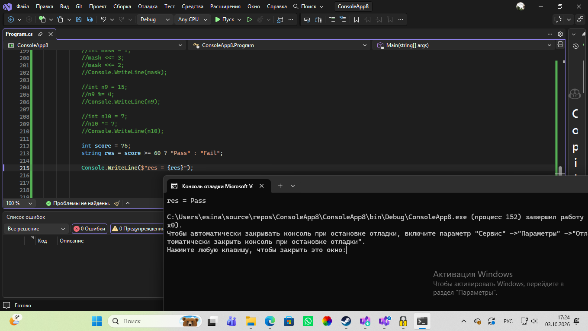 
</picture>

```csharp
using System;
using System.Collections.Generic;
using System.Linq;
using System.Text;
using System.Threading.Tasks;

namespace ConsoleApp1
{
    internal class Program
    {
        static void Main(string[] args)
        {
            int score = 75;
            string res = score >= 60 ? "Pass" : "Fail";
            Console.WriteLine($"{res}");
        }
    }
}
```

### Задание 2:Чему равно int x = 5; int y = (x > 10) ? 100 : (x > 2) ? 50 : 0;? Ответ: 50.

<picture> 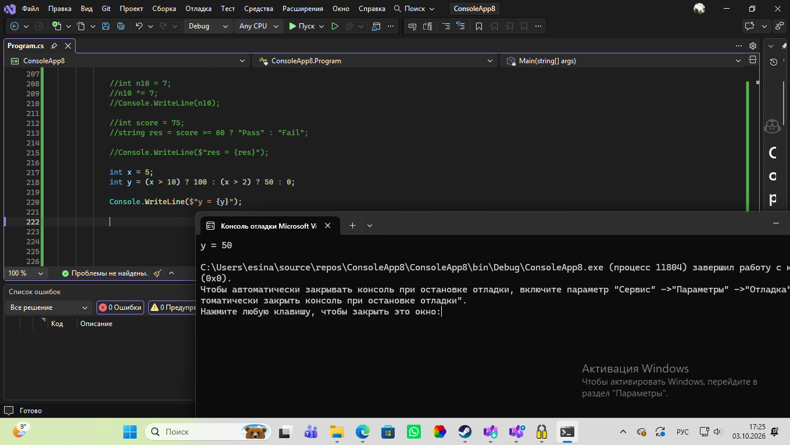 
</picture>

```csharp
using System;
using System.Collections.Generic;
using System.Linq;
using System.Text;
using System.Threading.Tasks;

namespace ConsoleApp1
{
    internal class Program
    {
        static void Main(string[] args)
        {
            int x = 5;
            int y = (x > 10) ? 100 : (x > 2) ? 50 : 0;
            Console.WriteLine($"{y}");
        }
    }
}
```

### Задание 3:Какой тип имеет результат выражения true ? 10 : 15.5? Ответ: double.

<picture> 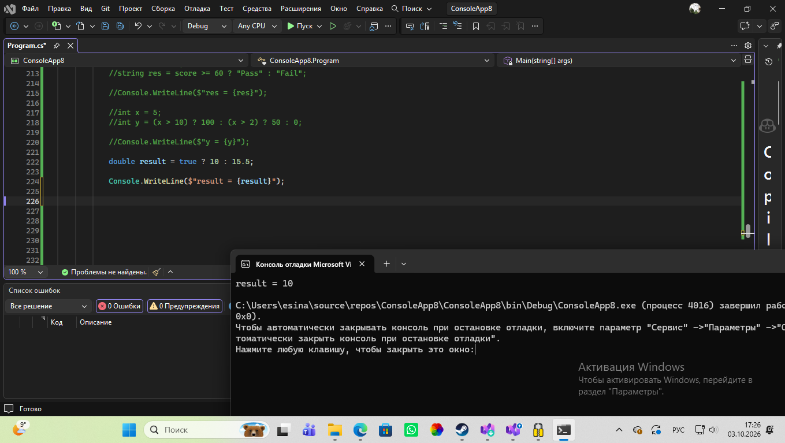 
</picture>

```csharp
using System;
using System.Collections.Generic;
using System.Linq;
using System.Text;
using System.Threading.Tasks;

namespace ConsoleApp1
{
    internal class Program
    {
        static void Main(string[] args)
        {
            double result = true ? 10 : 15.5;
            Console.WriteLine($"{result}");
        }
    }
}
```

### Задание 4:Что выведет выражение string s = null; Console.WriteLine(s?.Length);? Ответ: Ничего / null (оператор ?. предотвращает NullReferenceException).

<picture> 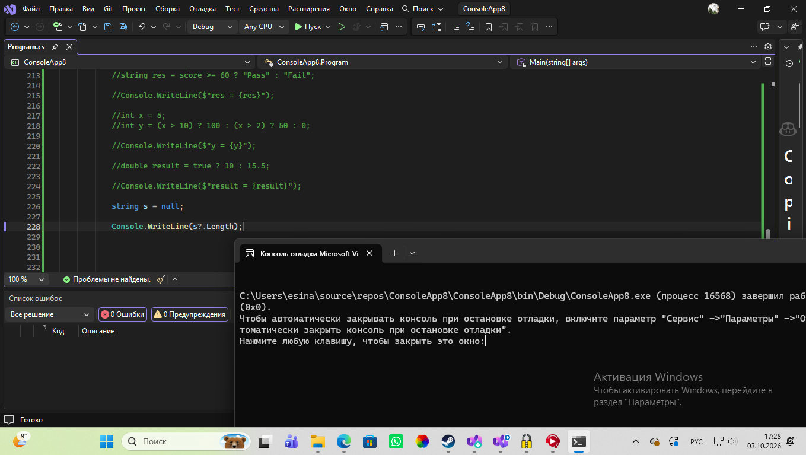 
</picture>

```csharp
using System;
using System.Collections.Generic;
using System.Linq;
using System.Text;
using System.Threading.Tasks;

namespace ConsoleApp1
{
    internal class Program
    {
        static void Main(string[] args)
        {
            string s = null;
            Console.WriteLine(s?.Length);
        }
    }
}
```

### Задание 5:Какой тип имеет результат выражения s?.Length для string s? Ответ: int? (Nullable<int>).

<picture> 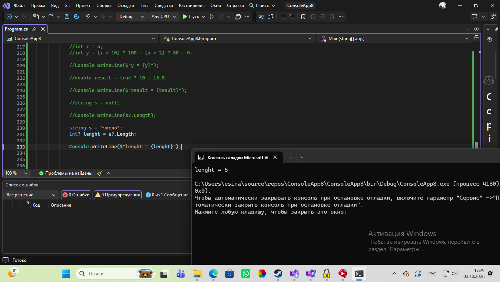 
</picture>

```csharp
using System;
using System.Collections.Generic;
using System.Linq;
using System.Text;
using System.Threading.Tasks;

namespace ConsoleApp1
{
    internal class Program
    {
        static void Main(string[] args)
        {
            string s = "Hello";
            var res = s?.Length;

            Console.WriteLine($"{res}");
            Console.WriteLine(res.GetType());

            Console.WriteLine($"{res}");   
            Console.WriteLine(res.GetType());
        }
    }
}
```

### Задание 6:Вычислите: string name = null; string res = name ?? "Anonymous";. Ответ: "Anonymous".

<picture> 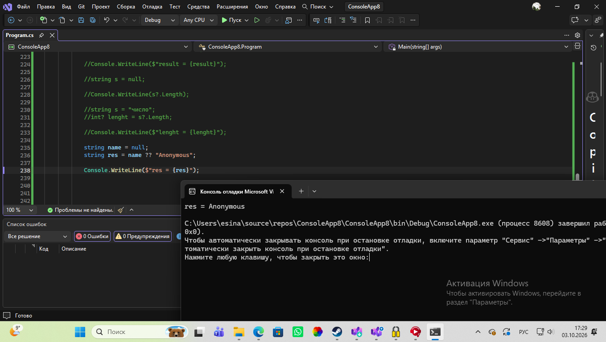 
</picture>

```csharp
using System;
using System.Collections.Generic;
using System.Linq;
using System.Text;
using System.Threading.Tasks;

namespace ConsoleApp1
{
    internal class Program
    {
        static void Main(string[] args)
        {
            string name = null;
            string res = name ?? "Anonymous";

            Console.WriteLine($"{res}");
        }
    }
}
```

### Задание 7:Вычислите: string a = null, b = "User", c = "Admin"; string res = a ?? b ?? c;. Ответ: "User".

<picture> 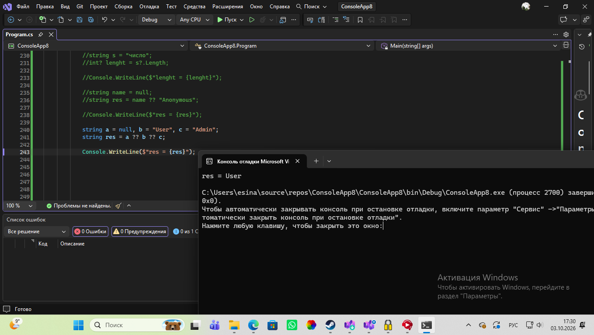 
</picture>

```csharp
using System;
using System.Collections.Generic;
using System.Linq;
using System.Text;
using System.Threading.Tasks;

namespace ConsoleApp1
{
    internal class Program
    {
        static void Main(string[] args)
        {
            string a = null, b = "User", c = "Admin";
            string res = a ?? b ?? c;
            Console.WriteLine($"{res}");
        }
    }
}
```

### Задание 8:Что вернет выражение false ? (10 / 0) : 42? Ответ: 42 (второй операнд не вычисляется из-за ложного условия).

<picture> 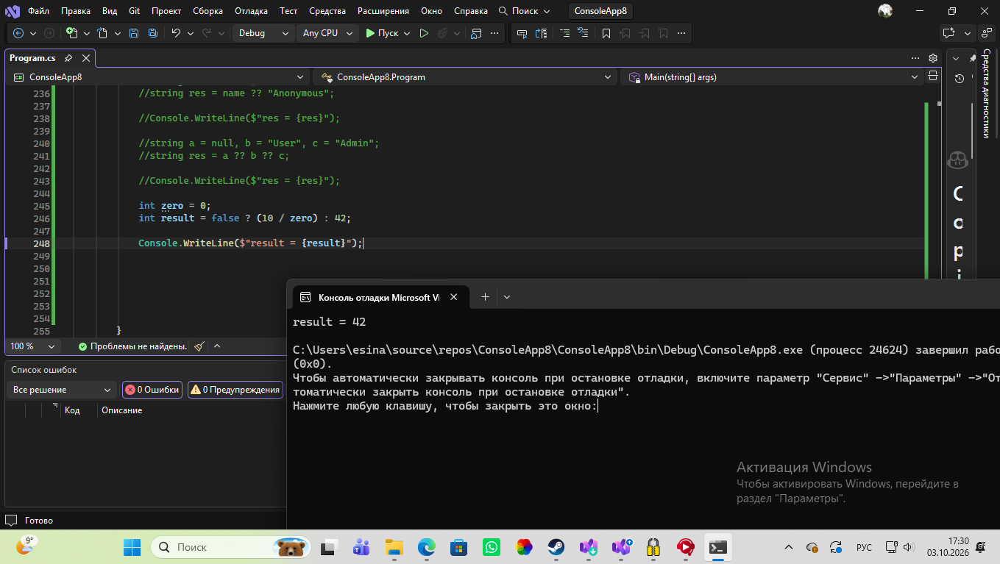 
</picture>

```csharp
using System;
using System.Collections.Generic;
using System.Linq;
using System.Text;
using System.Threading.Tasks;

namespace ConsoleApp1
{
    internal class Program
    {
        static void Main(string[] args)
        {
            int zero = 0
            int res = false ? (10 / zero) : 42; // второй операнд не вычисляется
            Console.WriteLine($"{res}");
        }
    }
}
```

### Задание 9:Скомпилируется ли код var x = condition ? 10 : "text";? Ответ: Нет (в классическом C#), так как у типов int и string нет неявного взаимного приведения.

<picture> 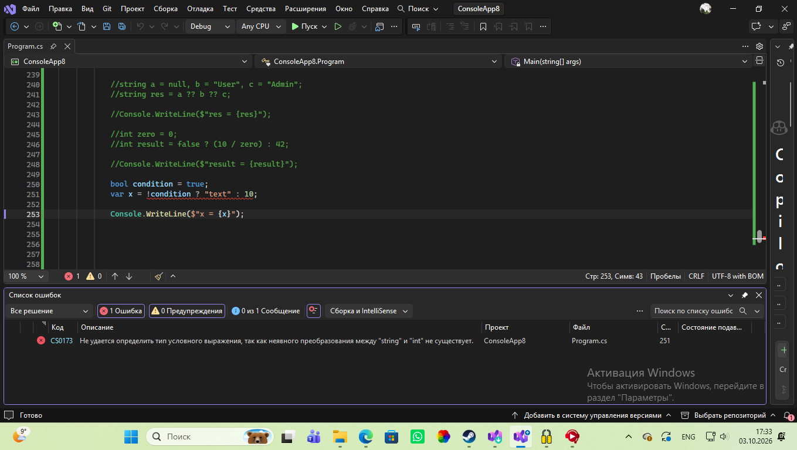 
</picture>

```csharp
using System;
using System.Collections.Generic;
using System.Linq;
using System.Text;
using System.Threading.Tasks;

namespace ConsoleApp1
{
    internal class Program
    {
        static void Main(string[] args)
        {
            bool condition = true;
            var x = condition ? 10 : "text"; // ошибка компиляции: нет общего типа
            Console.WriteLine($"{x}");
        }
    }
}
```

### Задание 10:Чему равно int? count = null; int res = count?.GetHashCode() ?? -1;? Ответ: -1.

<picture> 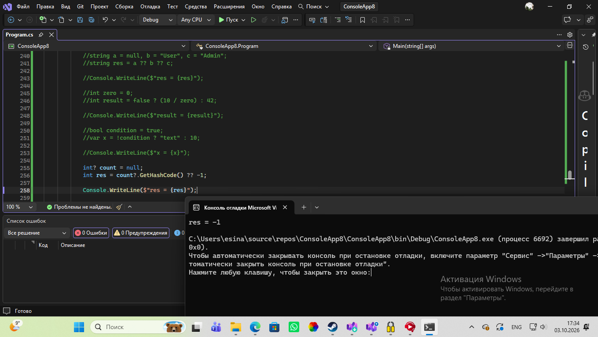 
</picture>

```csharp
using System;
using System.Collections.Generic;
using System.Linq;
using System.Text;
using System.Threading.Tasks;

namespace ConsoleApp1
{
    internal class Program
    {
        static void Main(string[] args)
        {
            int? count = null;
            int res = count?.GetHashCode() ?? -1;
            Console.WriteLine($"{res}");
        }
    }
}
```

## 3.7. Операторы типов и приведения

### Задание 1:Что вернет выражение object obj = "Hello"; bool check = obj is string;? Ответ: true.

<picture> 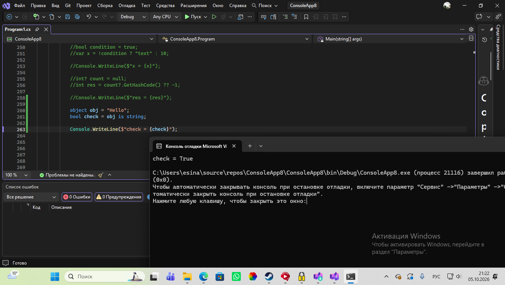 
</picture>

```csharp
using System;
using System.Collections.Generic;
using System.Linq;
using System.Text;
using System.Threading.Tasks;

namespace ConsoleApp1
{
    internal class Program
    {
        static void Main(string[] args)
        {
            object obj = "Hello";
            bool check = obj is string;
            Console.WriteLine($"{check}");
        }
    }
}
```

### Задание 2:Что вернет object obj = 123; string s = obj as string;? Ответ: null (оператор as возвращает null при невозможности безопасного приведения ссылочного типа).

<picture> 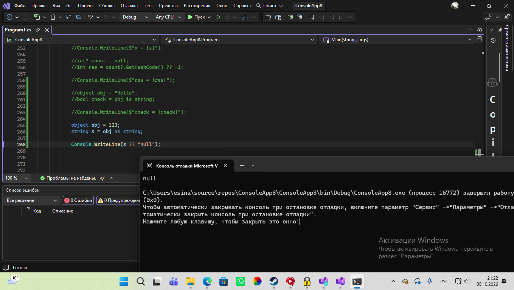 
</picture>

```csharp
using System;
using System.Collections.Generic;
using System.Linq;
using System.Text;
using System.Threading.Tasks;

namespace ConsoleApp1
{
    internal class Program
    {
        static void Main(string[] args)
        {
            object obj = 123;
            string s = obj as string; // null, т.к. небезопасное приведение
            Console.WriteLine(s ?? "null");
        }
    }
}
```

### Задание 3:Что произойдет при явном приведении object obj = 123; string s = (string)obj;? Ответ: Выбросится исключение System.InvalidCastException.

<picture> 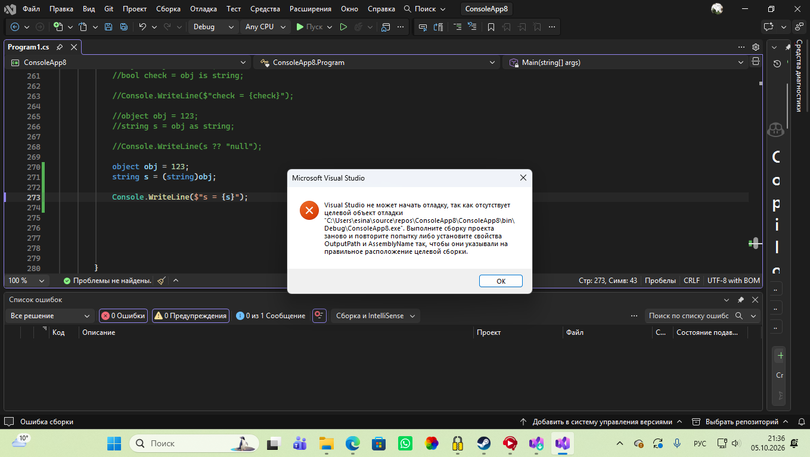 
</picture>

```csharp
using System;
using System.Collections.Generic;
using System.Linq;
using System.Text;
using System.Threading.Tasks;

namespace ConsoleApp1
{
    internal class Program
    {
        static void Main(string[] args)
        {
            object obj = 123;
            string s = (string)obj; // System.InvalidCastException
            Console.WriteLine($"{s}");
        }
    }
}
```

### Задание 4:Что вернет typeof(int) == typeof(Int32)? Ответ: true (псевдоним языка ссылается на один и тот же тип CLR).

<picture> 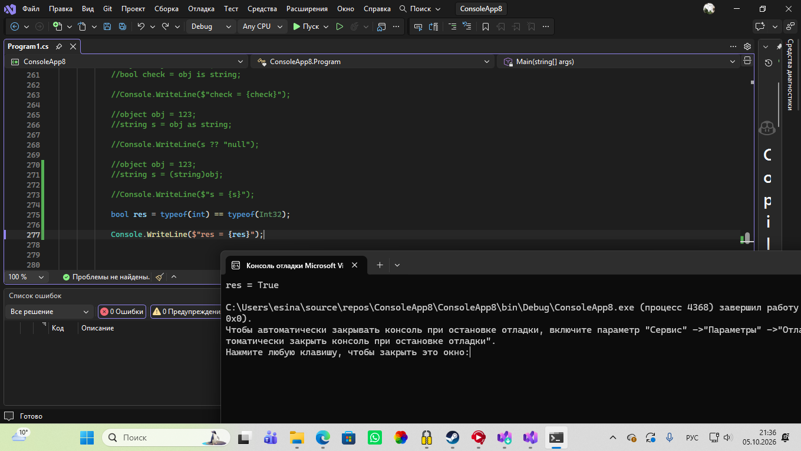 
</picture>

```csharp
using System;
using System.Collections.Generic;
using System.Linq;
using System.Text;
using System.Threading.Tasks;

namespace ConsoleApp1
{
    internal class Program
    {
        static void Main(string[] args)
        {
            bool res = typeof(int) == typeof(Int32);
            Console.WriteLine($"{res}");
        }
    }
}
```

### Задание 5:Чему равен результат sizeof(long) в байтах? Ответ: 8.

<picture> 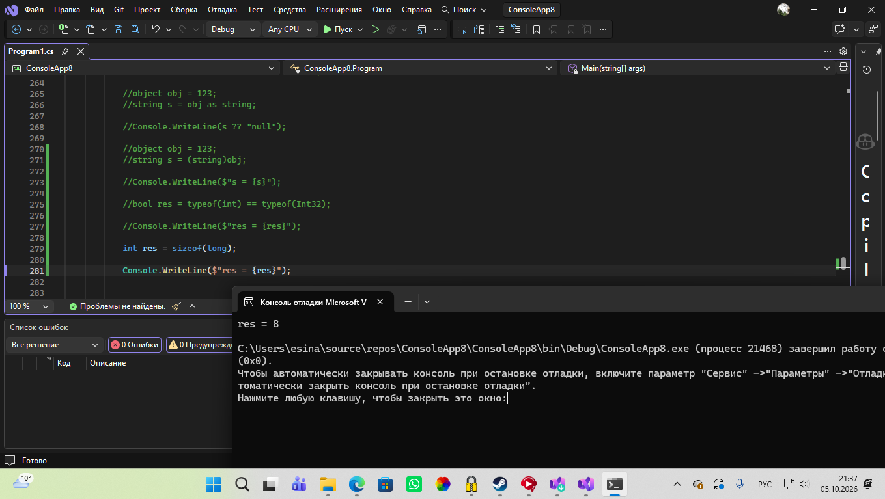 
</picture>

```csharp
using System;
using System.Collections.Generic;
using System.Linq;
using System.Text;
using System.Threading.Tasks;

namespace ConsoleApp1
{
    internal class Program
    {
        static void Main(string[] args)
        {
            int res = sizeof(long);
            Console.WriteLine($"{res}");
        }
    }
}
```

### Задание 6:Что вернет null is string? Ответ: false (шаблон is для null всегда возвращает false, кроме шаблона is null).

<picture> 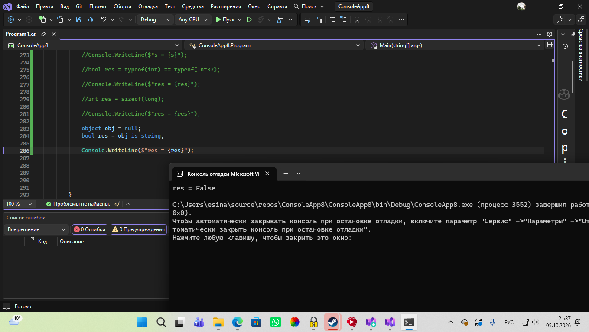 
</picture>

```csharp
using System;
using System.Collections.Generic;
using System.Linq;
using System.Text;
using System.Threading.Tasks;

namespace ConsoleApp1
{
    internal class Program
    {
        static void Main(string[] args)
        {
            object obj = null;
            bool res = obj is string;
            Console.WriteLine($"{res}");
        }
    }
}
```

### Задание 7:Что вернет выражение object x = null; bool b = x is null;? Ответ: true.

<picture> 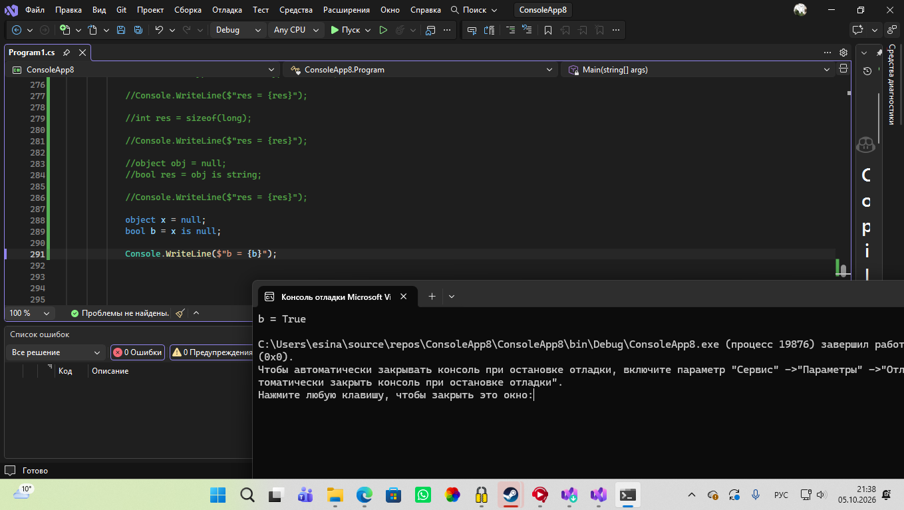 
</picture>

```csharp
using System;
using System.Collections.Generic;
using System.Linq;
using System.Text;
using System.Threading.Tasks;

namespace ConsoleApp1
{
    internal class Program
    {
        static void Main(string[] args)
        {
            object x = null;
            bool b = x is null;
            Console.WriteLine($"{b}");
        }
    }
}
```

### Задание 8:Каков результат (int)3.99? Ответ: 3 (дробная часть отсекается без округления).

<picture> 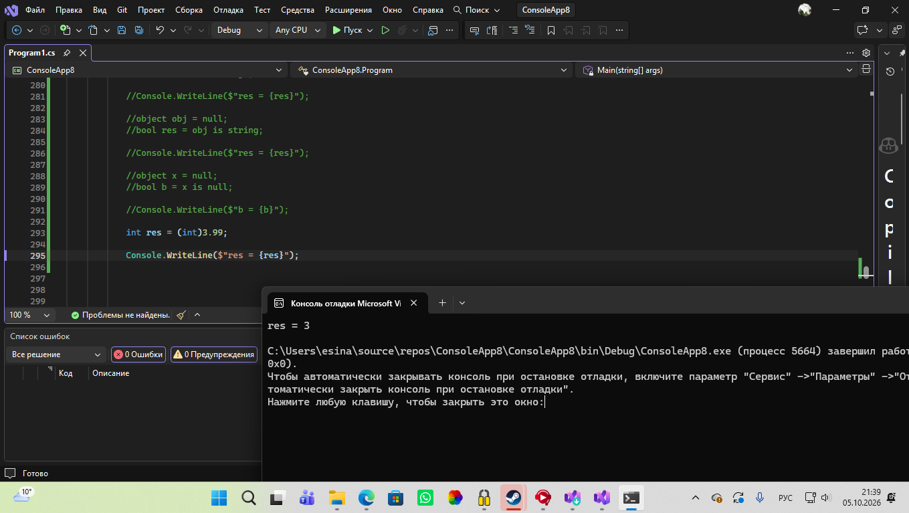 
</picture>

```csharp
using System;
using System.Collections.Generic;
using System.Linq;
using System.Text;
using System.Threading.Tasks;

namespace ConsoleApp1
{
    internal class Program
    {
        static void Main(string[] args)
        {
            int res = (int)3.99; // дробная часть отсекается
            Console.WriteLine($"{res}");
        }
    }
}
```

### Задание 9:Каков результат pattern matching

<picture> 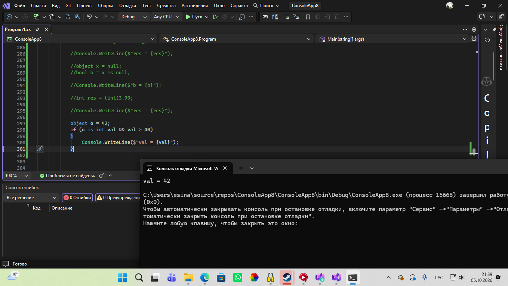 
</picture>

```csharp
using System;
using System.Collections.Generic;
using System.Linq;
using System.Text;
using System.Threading.Tasks;

namespace ConsoleApp1
{
    internal class Program
    {
        static void Main(string[] args)
        {
            object o = 42;
            if (o is int val && val > 40)
            {
            Console.WriteLine($"val = {val}");
            }
        }
    }
}
```

### Задание 10:Что вернет выражение default(int) и default(string)? Ответ: 0 и null.

<picture> 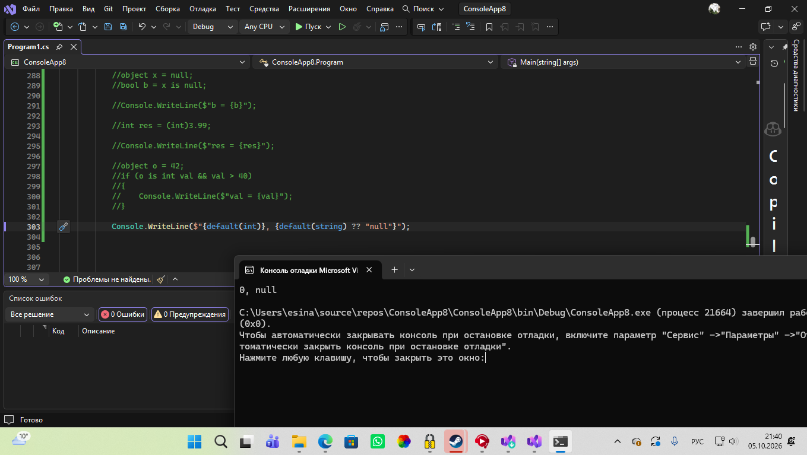 
</picture>

```csharp
using System;
using System.Collections.Generic;
using System.Linq;
using System.Text;
using System.Threading.Tasks;

namespace ConsoleApp1
{
    internal class Program
    {
        static void Main(string[] args)
        {
            Console.WriteLine($"{default(int)}, {default(string) ?? "null"}");
        }
    }
}
```

## 4. 35 сложносоставных заданий на логические выражения

### Задание 1:(5 > 3) && !(10 <= 2) || (4 == 5)

<picture> 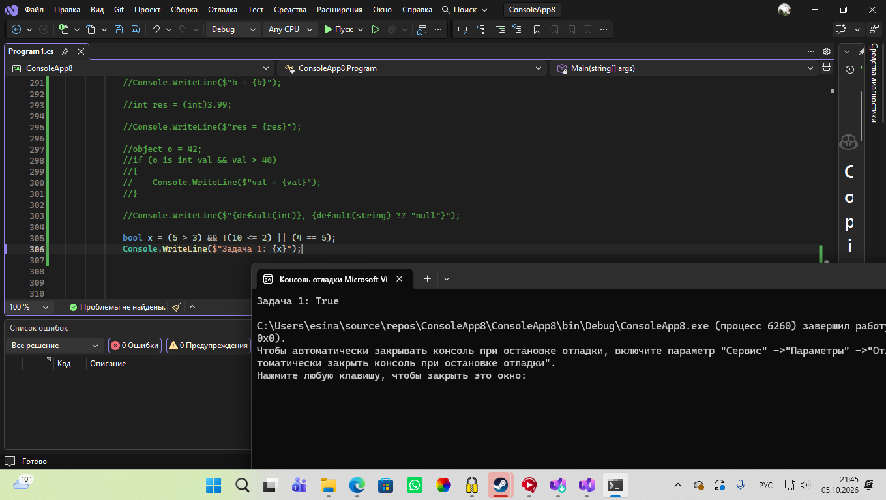 
</picture>

```csharp
using System;
using System.Collections.Generic;
using System.Linq;
using System.Text;
using System.Threading.Tasks;

namespace ConsoleApp1
{
    internal class Program
    {
        static void Main(string[] args)
        {
            bool res = (5 > 3) && !(10 <= 2) || (4 == 5);
            Console.WriteLine($"{res}");
        }
    }
}
```

### Задание 2:!(true && false) ^ (true || false && false)

<picture> 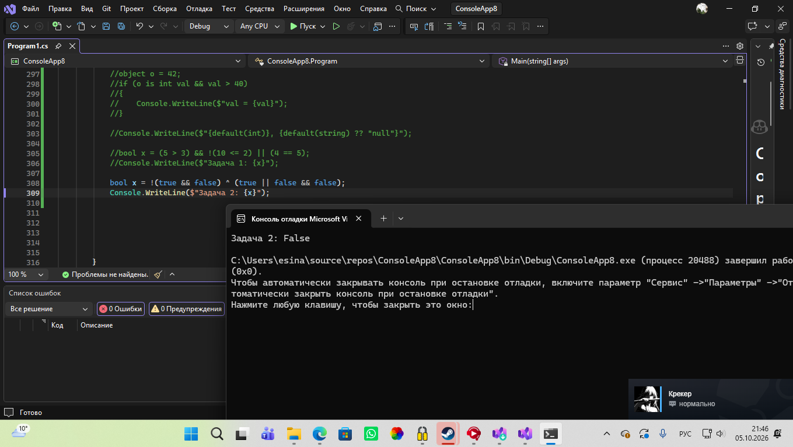 
</picture>

```csharp
using System;
using System.Collections.Generic;
using System.Linq;
using System.Text;
using System.Threading.Tasks;

namespace ConsoleApp1
{
    internal class Program
    {
        static void Main(string[] args)
        {
            bool res = !(true && false) ^ (true || false && false);
            Console.WriteLine($"{res}");
        }
    }
}
```

### Задание 3:(10 & 6) == 2 && (10 | 6) == 14

<picture> 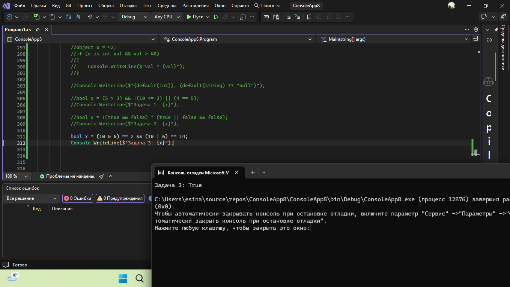 
</picture>

```csharp
using System;
using System.Collections.Generic;
using System.Linq;
using System.Text;
using System.Threading.Tasks;

namespace ConsoleApp1
{
    internal class Program
    {
        static void Main(string[] args)
        {
            bool res = (10 & 6) == 2 && (10 | 6) == 14;
            Console.WriteLine($"{res}");
        }
    }
}
```

### Задание 4:(15 >> 1 == 7) && (7 << 2 == 28)

<picture> 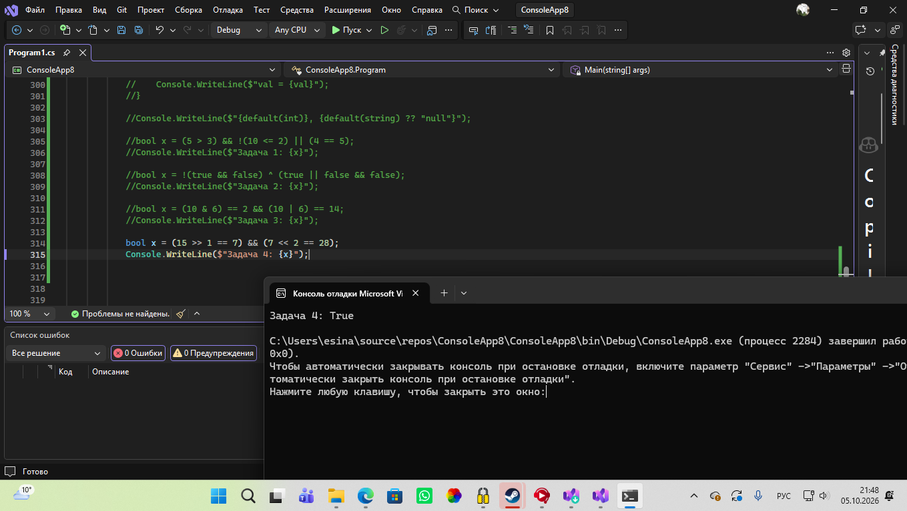 
</picture>

```csharp
using System;
using System.Collections.Generic;
using System.Linq;
using System.Text;
using System.Threading.Tasks;

namespace ConsoleApp1
{
    internal class Program
    {
        static void Main(string[] args)
        {
            bool res = (15 >> 1 == 7) && (7 << 2 == 28);
            Console.WriteLine($"{res}");
        }
    }
}
```

### Задание 5:(8 > 5) && (3 + 2 * 4 == 11) && !(false || !true)

<picture>  
</picture>

```csharp
using System;
using System.Collections.Generic;
using System.Linq;
using System.Text;
using System.Threading.Tasks;

namespace ConsoleApp1
{
    internal class Program
    {
        static void Main(string[] args)
        {
            bool res = (8 > 5) && (3 + 2 * 4 == 11) && !(false || !true);
            Console.WriteLine($"{res}");
        }
    }
}
```

### Задание 6:(true || false) && (false || true) ^ (true && !false)

<picture> 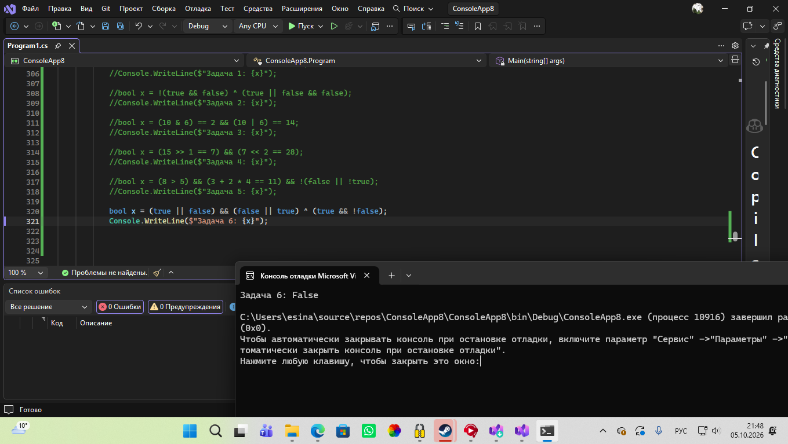 
</picture>

```csharp
using System;
using System.Collections.Generic;
using System.Linq;
using System.Text;
using System.Threading.Tasks;

namespace ConsoleApp1
{
    internal class Program
    {
        static void Main(string[] args)
        {
            bool res = (true || false) && (false || true) ^ (true && !false);
            Console.WriteLine($"{res}");
        }
    }
}
```

### Задание 7:(100 / 10 == 10) && (100 % 30 == 10) && !(5 - 5 != 0)

<picture> 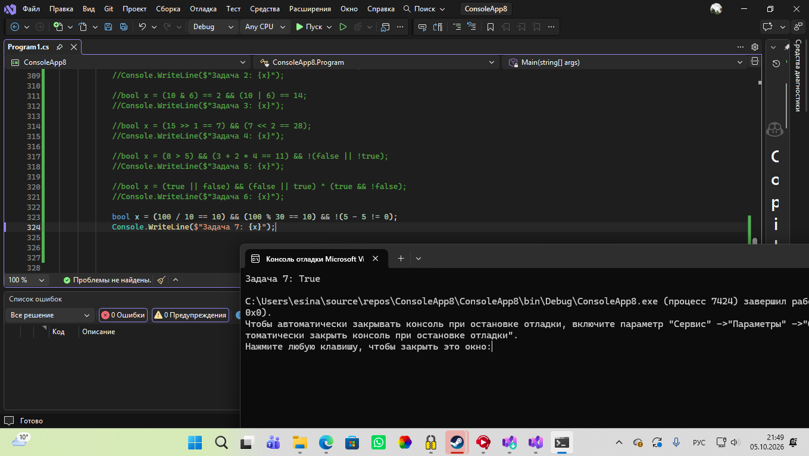 
</picture>

```csharp
using System;
using System.Collections.Generic;
using System.Linq;
using System.Text;
using System.Threading.Tasks;

namespace ConsoleApp1
{
    internal class Program
    {
        static void Main(string[] args)
        {
            bool res = (100 / 10 == 10) && (100 % 30 == 10) && !(5 - 5 != 0);
            Console.WriteLine($"{res}");
        }
    }
}
```

### Задание 8:(4 ^ 4) == 0 && (4 ^ 0) == 4 && (0 ^ 0) == 0

<picture> 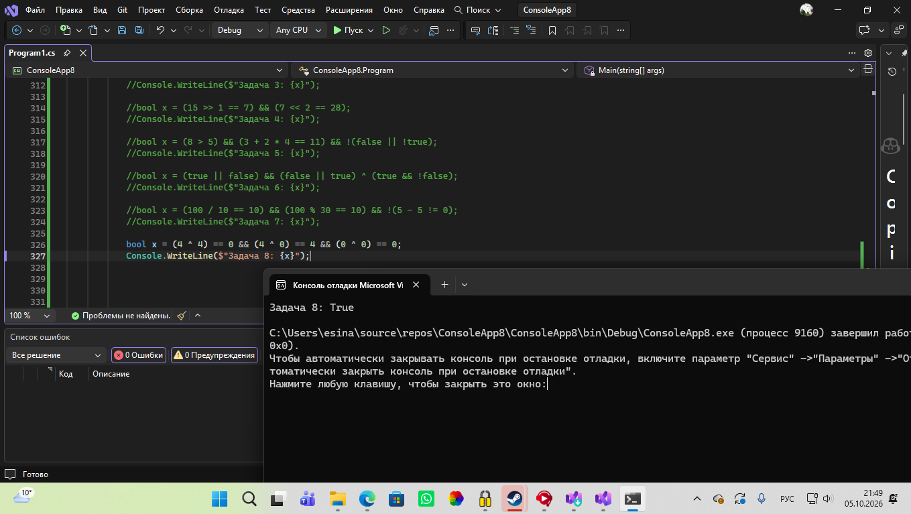 
</picture>

```csharp
using System;
using System.Collections.Generic;
using System.Linq;
using System.Text;
using System.Threading.Tasks;

namespace ConsoleApp1
{
    internal class Program
    {
        static void Main(string[] args)
        {
            bool res = (4 ^ 4) == 0 && (4 ^ 0) == 4 && (0 ^ 0) == 0;
            Console.WriteLine($"{res}");
        }
    }
}
```

### Задание 9:!(5 != 5) && ((3 >= 3) || (10 / 0 == 1))

<picture>  
</picture>

```csharp
using System;
using System.Collections.Generic;
using System.Linq;
using System.Text;
using System.Threading.Tasks;

namespace ConsoleApp1
{
    internal class Program
    {
        static void Main(string[] args)
        {
            bool res = !(5 != 5) && ((3 >= 3) || (10 / 0 == 1));
            Console.WriteLine($"{res}");
        }
    }
}
```

### Задание 10:(false && (10 / 0 == 1)) || (true && (20 > 15))

<picture> 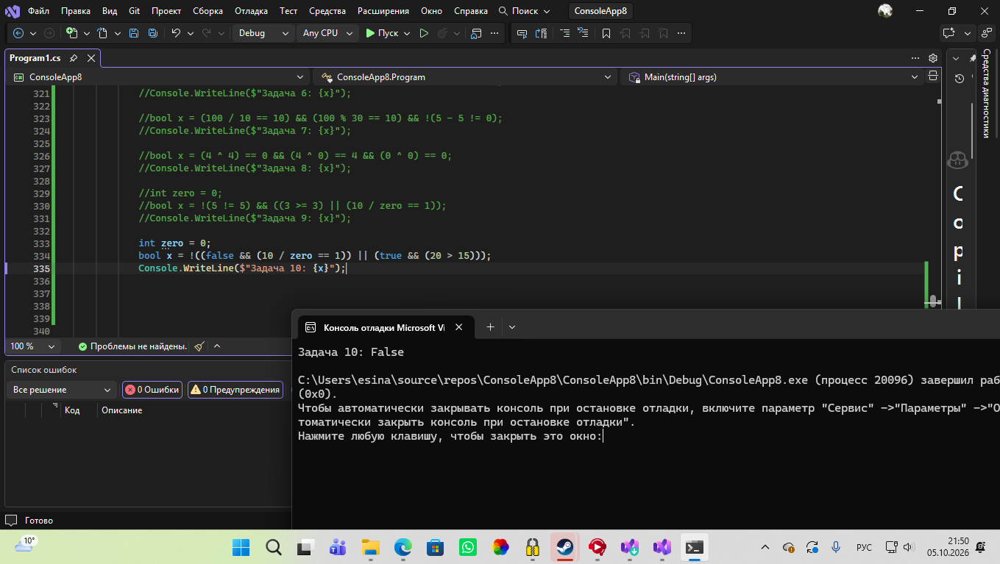 
</picture>

```csharp
using System;
using System.Collections.Generic;
using System.Linq;
using System.Text;
using System.Threading.Tasks;

namespace ConsoleApp1
{
    internal class Program
    {
        static void Main(string[] args)
        {
            bool res = (false && (10 / 0 == 1)) || (true && (20 > 15));
            Console.WriteLine($"{res}");
        }
    }
}
```

### Задание 11:(12 & 10) > 5 || (12 | 10) < 15 && !(3 == 3)

<picture> 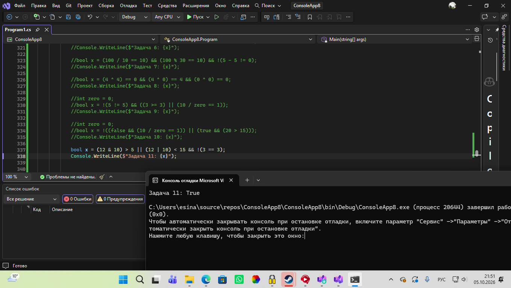 
</picture>

```csharp
using System;
using System.Collections.Generic;
using System.Linq;
using System.Text;
using System.Threading.Tasks;

namespace ConsoleApp1
{
    internal class Program
    {
        static void Main(string[] args)
        {
            bool res = (12 & 10) > 5 || (12 | 10) < 15 && !(3 == 3);
            Console.WriteLine($"{res}");
        }
    }
}
```

### Задание 12:((20 >> 2) == 5) ^ ((5 << 1) == 11)

<picture>  
</picture>

```csharp
using System;
using System.Collections.Generic;
using System.Linq;
using System.Text;
using System.Threading.Tasks;

namespace ConsoleApp1
{
    internal class Program
    {
        static void Main(string[] args)
        {
            bool res = ((20 >> 2) == 5) ^ ((5 << 1) == 11);
            Console.WriteLine($"{res}");
        }
    }
}
```

### Задание 13:!(!(true || false) && (true && !false))

<picture> 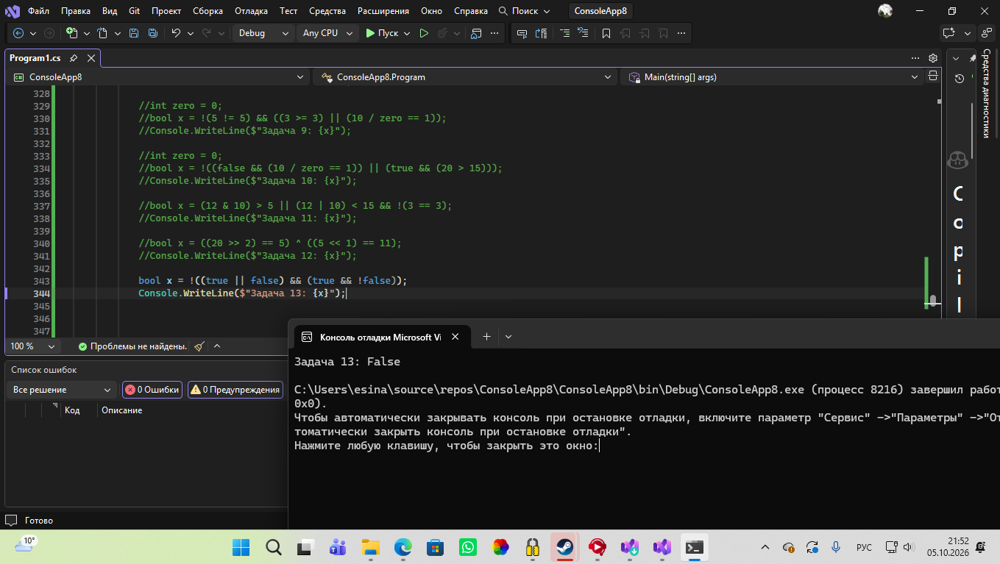 
</picture>

```csharp
using System;
using System.Collections.Generic;
using System.Linq;
using System.Text;
using System.Threading.Tasks;

namespace ConsoleApp1
{
    internal class Program
    {
        static void Main(string[] args)
        {
            bool res = !(!(true || false) && (true && !false));
            Console.WriteLine($"{res}");
        }
    }
}
```

### Задание 14:(7 > 2 ? 10 : 20) == 10 && (3 < 1 ? 5 : 15) == 15

<picture> 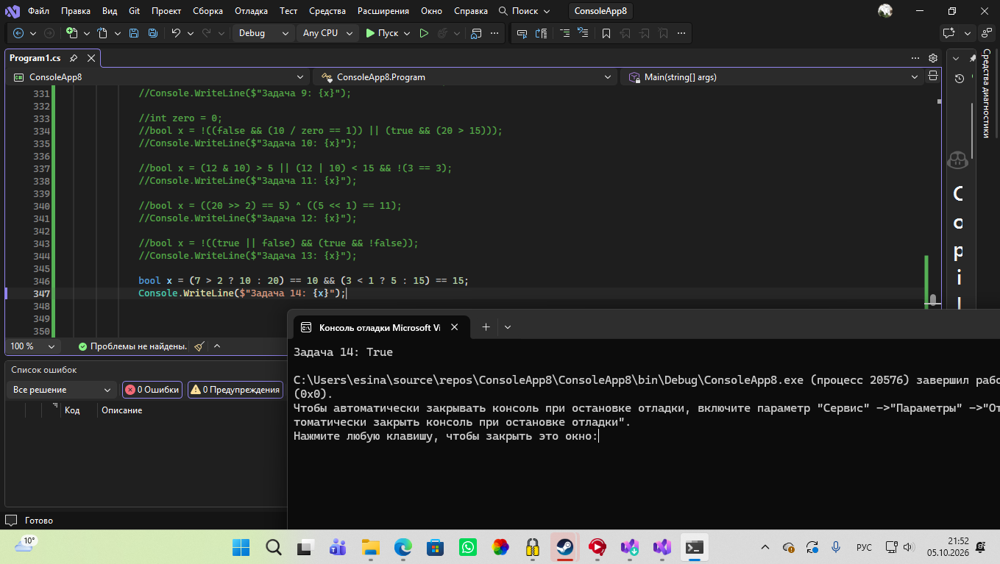 
</picture>

```csharp
using System;
using System.Collections.Generic;
using System.Linq;
using System.Text;
using System.Threading.Tasks;

namespace ConsoleApp1
{
    internal class Program
    {
        static void Main(string[] args)
        {
            bool res = (7 > 2 ? 10 : 20) == 10 && (3 < 1 ? 5 : 15) == 15;
            Console.WriteLine($"{res}");
        }
    }
}
```

### Задание 15:(5 & 1) == 1 && (6 & 1) == 0 && (7 & 1) == 1

<picture> 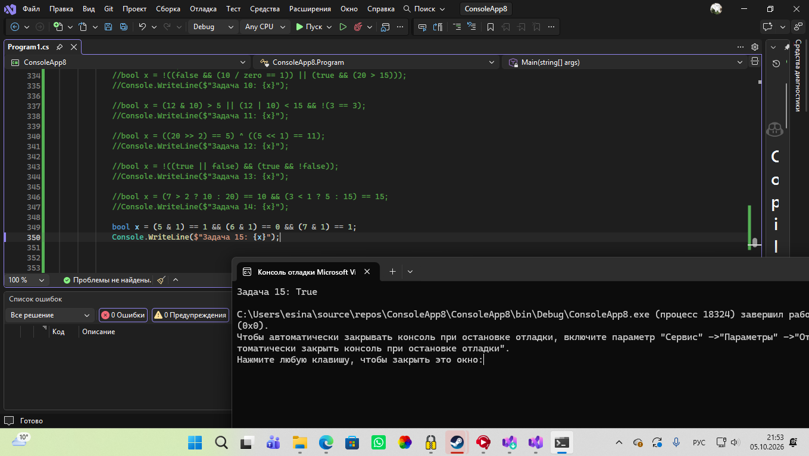 
</picture>

```csharp
using System;
using System.Collections.Generic;
using System.Linq;
using System.Text;
using System.Threading.Tasks;

namespace ConsoleApp1
{
    internal class Program
    {
        static void Main(string[] args)
        {
            bool res = (5 & 1) == 1 && (6 & 1) == 0 && (7 & 1) == 1;
            Console.WriteLine($"{res}");
        }
    }
}
```

### Задание 16:((10 > 5 ? true : false) ^ (3 > 8 ? true : false)) && !false

<picture> 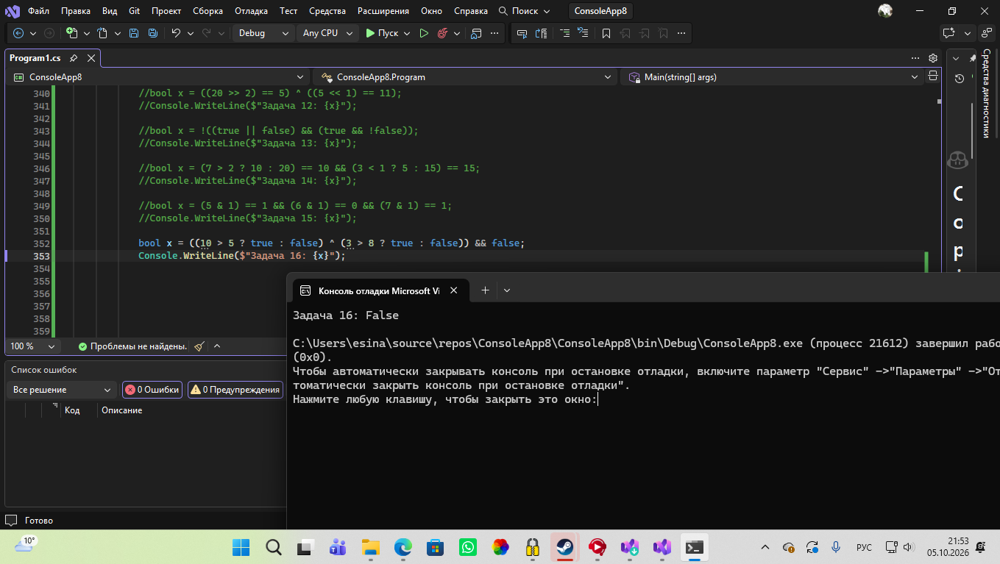 
</picture>

```csharp
using System;
using System.Collections.Generic;
using System.Linq;
using System.Text;
using System.Threading.Tasks;

namespace ConsoleApp1
{
    internal class Program
    {
        static void Main(string[] args)
        {
            bool res = ((10 > 5 ? true : false) ^ (3 > 8 ? true : false)) && !false;
            Console.WriteLine($"{res}");
        }
    }
}
```

### Задание 17:!( (5 > 2 && 10 > 20) || (3 == 3 && 4 <= 4) )

<picture> 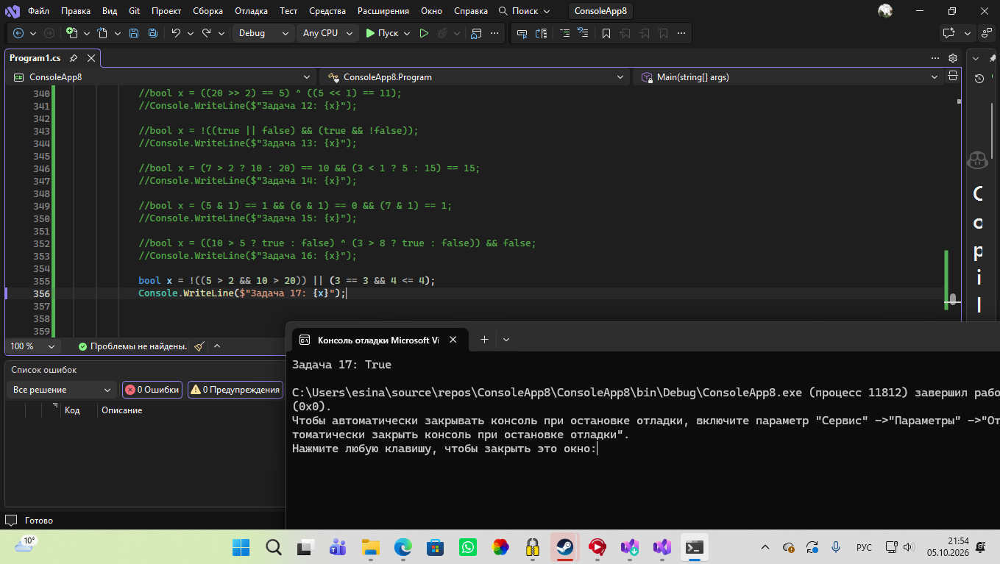 
</picture>

```csharp
using System;
using System.Collections.Generic;
using System.Linq;
using System.Text;
using System.Threading.Tasks;

namespace ConsoleApp1
{
    internal class Program
    {
        static void Main(string[] args)
        {
            bool res = !((5 > 2 && 10 > 20) || (3 == 3 && 4 <= 4));
            Console.WriteLine($"{res}");
        }
    }
}
```

### Задание 18:( (1 << 3) == 8 ) && ( (16 >> 4) == 1 ) && ( (2 << 2) == 8 )

<picture> 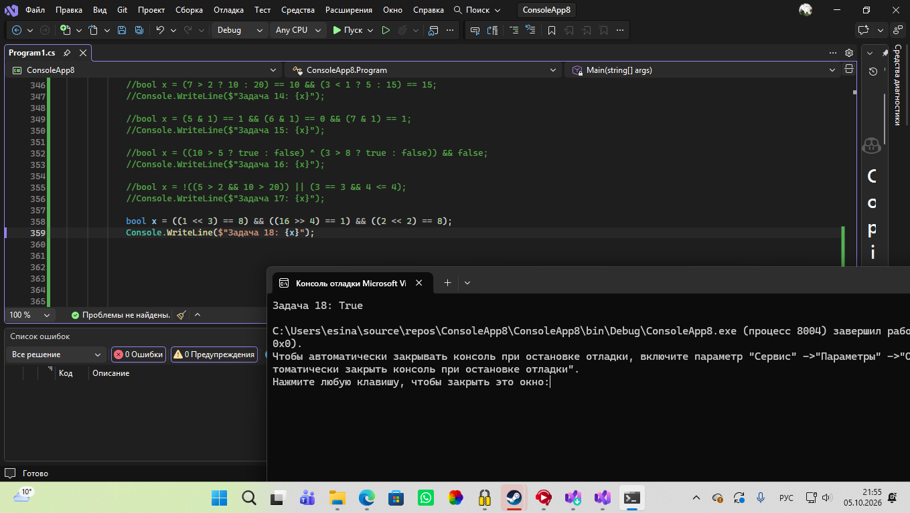 
</picture>

```csharp
using System;
using System.Collections.Generic;
using System.Linq;
using System.Text;
using System.Threading.Tasks;

namespace ConsoleApp1
{
    internal class Program
    {
        static void Main(string[] args)
        {
            bool res = ((1 << 3) == 8) && ((16 >> 4) == 1) && ((2 << 2) == 8);
            Console.WriteLine($"{res}");
        }
    }
}
```

### Задание 19:( (10 & 7) == 2 ) || ( (10 | 7) == 15 ) ^ !(4 > 1)

<picture>  
</picture>

```csharp
using System;
using System.Collections.Generic;
using System.Linq;
using System.Text;
using System.Threading.Tasks;

namespace ConsoleApp1
{
    internal class Program
    {
        static void Main(string[] args)
        {
            bool res = ((10 & 7) == 2) || ((10 | 7) == 15) ^ !(4 > 1);
            Console.WriteLine($"{res}");
        }
    }
}
```

### Задание 20:false || true && false || true && !false

<picture> 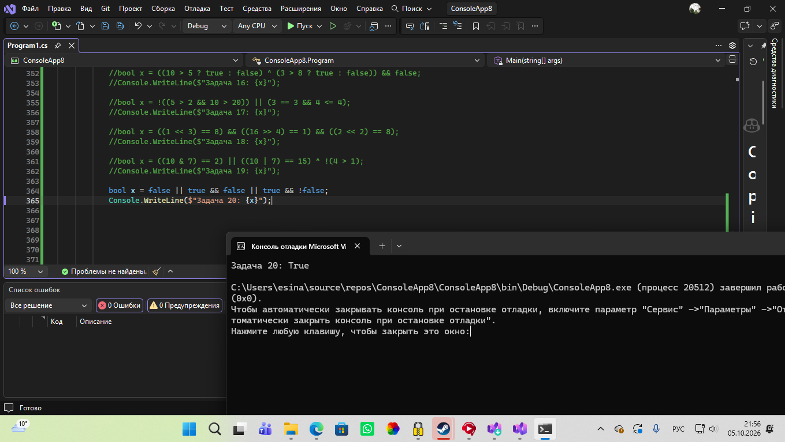 
</picture>

```csharp
using System;
using System.Collections.Generic;
using System.Linq;
using System.Text;
using System.Threading.Tasks;

namespace ConsoleApp1
{
    internal class Program
    {
        static void Main(string[] args)
        {
            bool res = false || true && false || true && !false;
            Console.WriteLine($"{res}");
        }
    }
}
```

### Задание 21:(25 % 4 == 1) && (17 / 3 == 5) && (17 % 3 == 2)

<picture>  
</picture>

```csharp
using System;
using System.Collections.Generic;
using System.Linq;
using System.Text;
using System.Threading.Tasks;

namespace ConsoleApp1
{
    internal class Program
    {
        static void Main(string[] args)
        {
            bool res = (25 % 4 == 1) && (17 / 3 == 5) && (17 % 3 == 2);
            Console.WriteLine($"{res}");
        }
    }
}
```

### Задание 22:( (5 ^ 3 ^ 3) == 5 ) && ( (10 ^ 0) == 10 )

<picture> 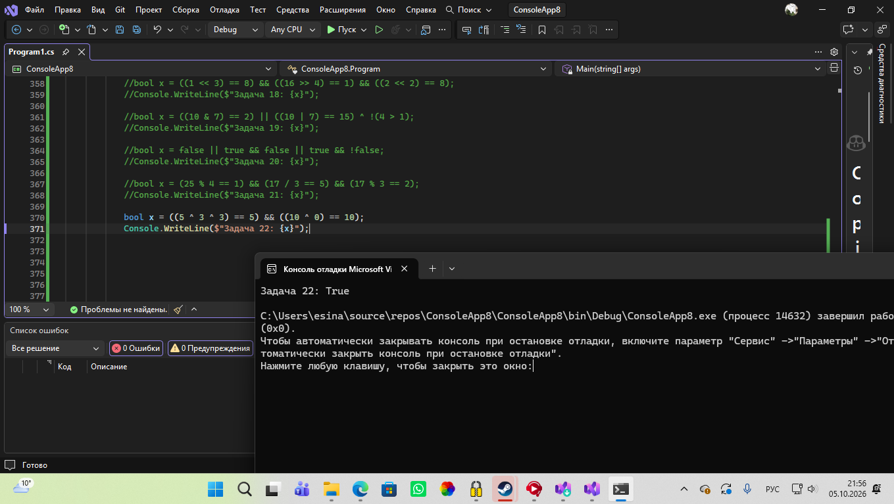 
</picture>

```csharp
using System;
using System.Collections.Generic;
using System.Linq;
using System.Text;
using System.Threading.Tasks;

namespace ConsoleApp1
{
    internal class Program
    {
        static void Main(string[] args)
        {
            bool res = ((5 ^ 3 ^ 3) == 5) && ((10 ^ 0) == 10);
            Console.WriteLine($"{res}");
        }
    }
}
```

### Задание 23:(true ? (false ? 1 : 2) : (true ? 3 : 4)) == 2

<picture> 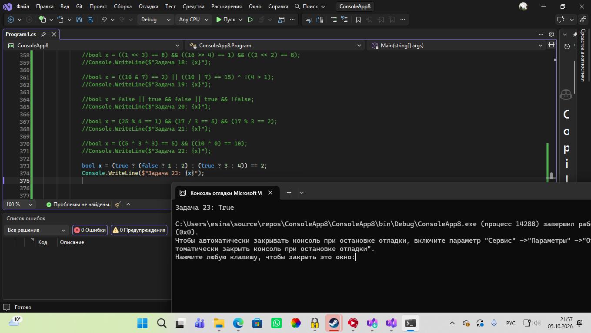 
</picture>

```csharp
using System;
using System.Collections.Generic;
using System.Linq;
using System.Text;
using System.Threading.Tasks;

namespace ConsoleApp1
{
    internal class Program
    {
        static void Main(string[] args)
        {
            bool res = (true ? (false ? 1 : 2) : (true ? 3 : 4)) == 2;
            Console.WriteLine($"{res}");
        }
    }
}
```

### Задание 24:!(true && !(false || !false))

<picture> 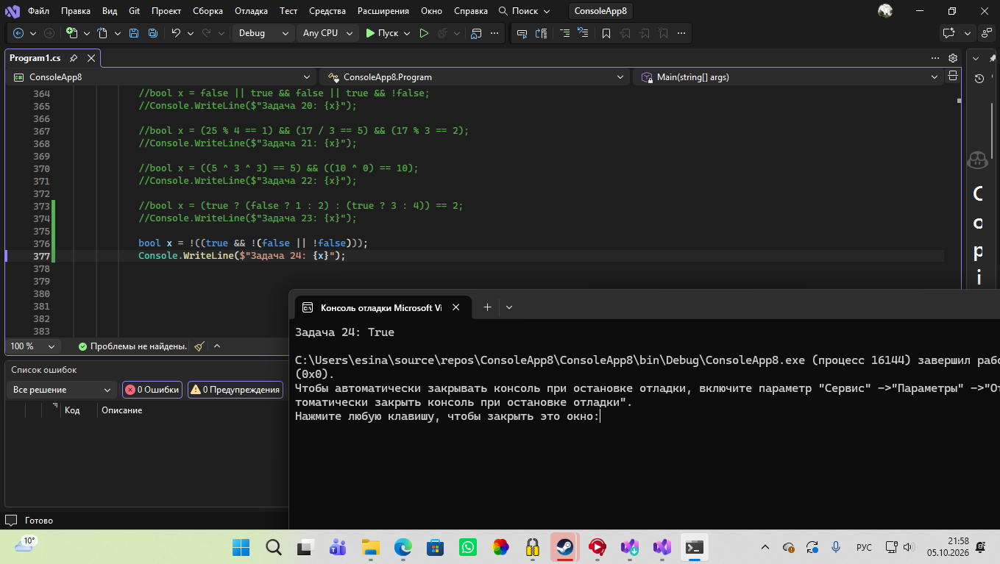 
</picture>

```csharp
using System;
using System.Collections.Generic;
using System.Linq;
using System.Text;
using System.Threading.Tasks;

namespace ConsoleApp1
{
    internal class Program
    {
        static void Main(string[] args)
        {
            bool res = !(true && !(false || !false));
            Console.WriteLine($"{res}");
        }
    }
}
```

### Задание 25:( (~0 == -1) && (~(-1) == 0) )

<picture> 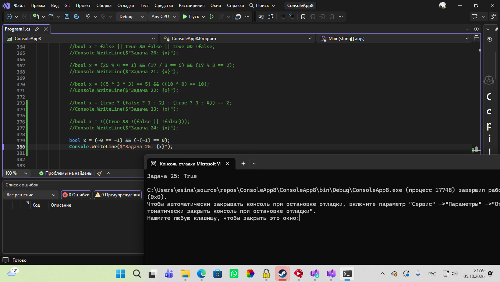 
</picture>

```csharp
using System;
using System.Collections.Generic;
using System.Linq;
using System.Text;
using System.Threading.Tasks;

namespace ConsoleApp1
{
    internal class Program
    {
        static void Main(string[] args)
        {
            bool res = ((~0 == -1) && (~(-1) == 0));
            Console.WriteLine($"{res}");
        }
    }
}
```

### Задание 26:( (8 & 4) == 0 ) && ( (8 | 4) == 12 ) && ( (8 ^ 4) == 12 )

<picture> 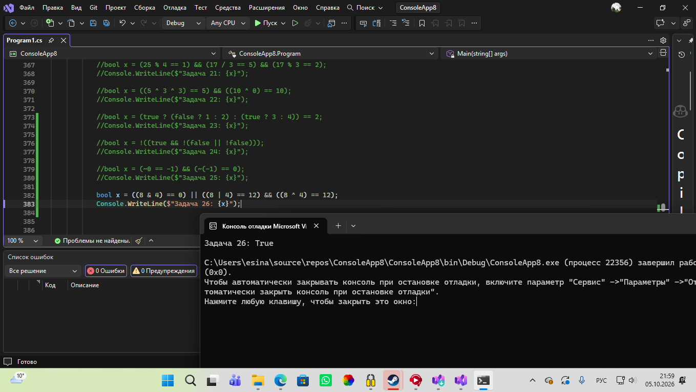 
</picture>

```csharp
using System;
using System.Collections.Generic;
using System.Linq;
using System.Text;
using System.Threading.Tasks;

namespace ConsoleApp1
{
    internal class Program
    {
        static void Main(string[] args)
        {
            bool res = ((8 & 4) == 0) && ((8 | 4) == 12) && ((8 ^ 4) == 12);
            Console.WriteLine($"{res}");
        }
    }
}
```

### Задание 27:!(10 >= 10) || (5 < 3) && (2 == 2) || !(false)

<picture> 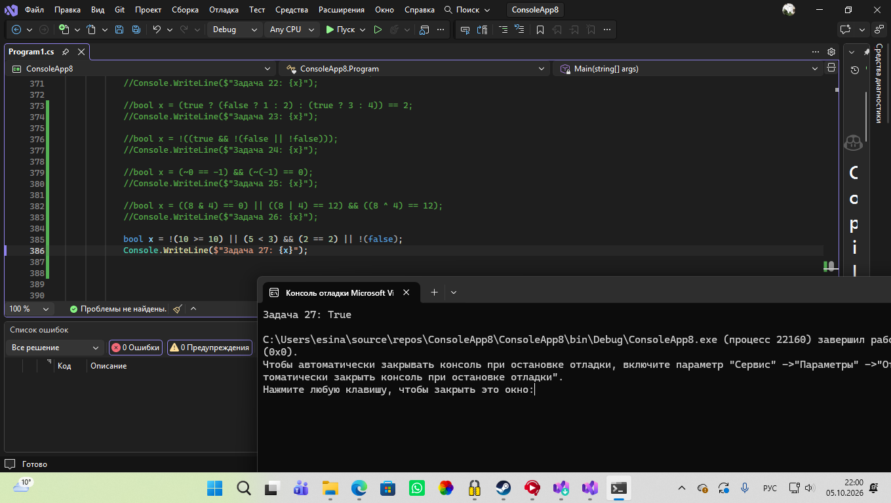 
</picture>

```csharp
using System;
using System.Collections.Generic;
using System.Linq;
using System.Text;
using System.Threading.Tasks;

namespace ConsoleApp1
{
    internal class Program
    {
        static void Main(string[] args)
        {
            bool res = !(10 >= 10) || (5 < 3) && (2 == 2) || !(false);
            Console.WriteLine($"{res}");
        }
    }
}
```

### Задание 28:( (15 & ~1) == 14 ) && ( (14 | 1) == 15 )

<picture> 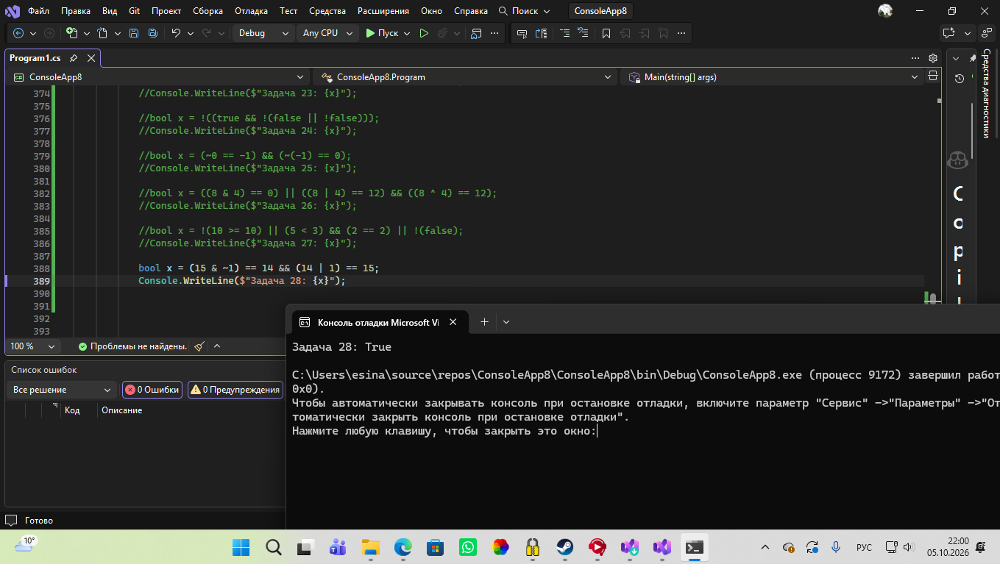 
</picture>

```csharp
using System;
using System.Collections.Generic;
using System.Linq;
using System.Text;
using System.Threading.Tasks;

namespace ConsoleApp1
{
    internal class Program
    {
        static void Main(string[] args)
        {
            bool res = ((15 & ~1) == 14) && ((14 | 1) == 15);
            Console.WriteLine($"{res}");
        }
    }
}
```

### Задание 29:( (true || false) ? (false && true ? 10 : 20) : 30 ) == 20

<picture> 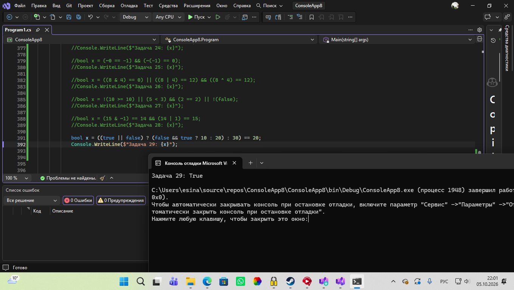 
</picture>

```csharp
using System;
using System.Collections.Generic;
using System.Linq;
using System.Text;
using System.Threading.Tasks;

namespace ConsoleApp1
{
    internal class Program
    {
        static void Main(string[] args)
        {
            bool res = ((true || false) ? (false && true ? 10 : 20) : 30) == 20;
            Console.WriteLine($"{res}");
        }
    }
}
```

### Задание 30:( (10 > 2) && (5 < 9) ) ^ ( !(4 >= 5) && (6 != 7) )

<picture> 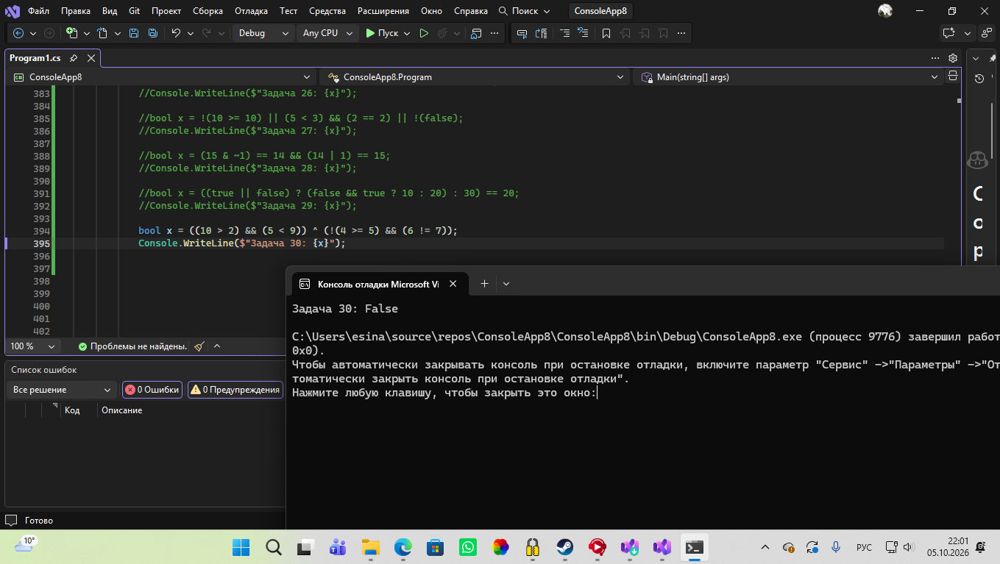 
</picture>

```csharp
using System;
using System.Collections.Generic;
using System.Linq;
using System.Text;
using System.Threading.Tasks;

namespace ConsoleApp1
{
    internal class Program
    {
        static void Main(string[] args)
        {
            bool res = ((10 > 2) && (5 < 9)) ^ (!(4 >= 5) && (6 != 7));
            Console.WriteLine($"{res}");
        }
    }
}
```

### Задание 31:(7 & 3 & 1) == 1 && (7 | 3 | 1) == 7

<picture>  
</picture>

```csharp
using System;
using System.Collections.Generic;
using System.Linq;
using System.Text;
using System.Threading.Tasks;

namespace ConsoleApp1
{
    internal class Program
    {
        static void Main(string[] args)
        {
            bool res = (7 & 3 & 1) == 1 && (7 | 3 | 1) == 7;
            Console.WriteLine($"{res}");
        }
    }
}
```

### Задание 32:( (10 > 5 && 3 < 1) || (8 == 8 && !(5 > 10)) ) && (4 + 4 == 8)

<picture> 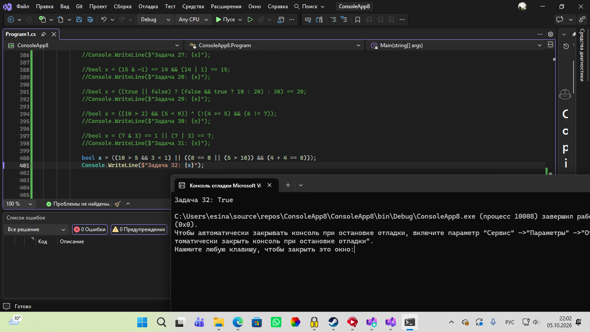 
</picture>

```csharp
using System;
using System.Collections.Generic;
using System.Linq;
using System.Text;
using System.Threading.Tasks;

namespace ConsoleApp1
{
    internal class Program
    {
        static void Main(string[] args)
        {
            bool res = ((10 > 5 && 3 < 1) || (8 == 8 && !(5 > 10))) && (4 + 4 == 8);
            Console.WriteLine($"{res}");
        }
    }
}
```

### Задание 33:!( (!(true && false) || !(true || false)) && !false )

<picture> 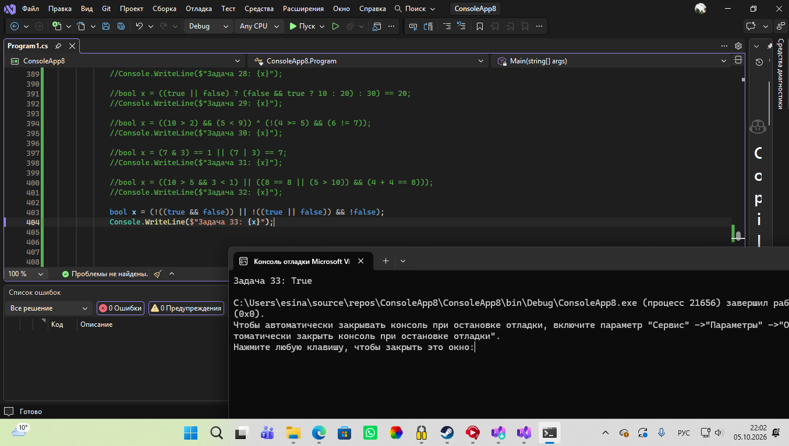 
</picture>

```csharp
using System;
using System.Collections.Generic;
using System.Linq;
using System.Text;
using System.Threading.Tasks;

namespace ConsoleApp1
{
    internal class Program
    {
        static void Main(string[] args)
        {
            bool res = !((!(true && false) || !(true || false)) && !false);
            Console.WriteLine($"{res}");
        }
    }
}
```

### Задание 34:( (32 >> 3 == 4) && (4 << 3 == 32) ) ^ ( (15 & 7) == 7 && (15 | 7) == 15 )

<picture> 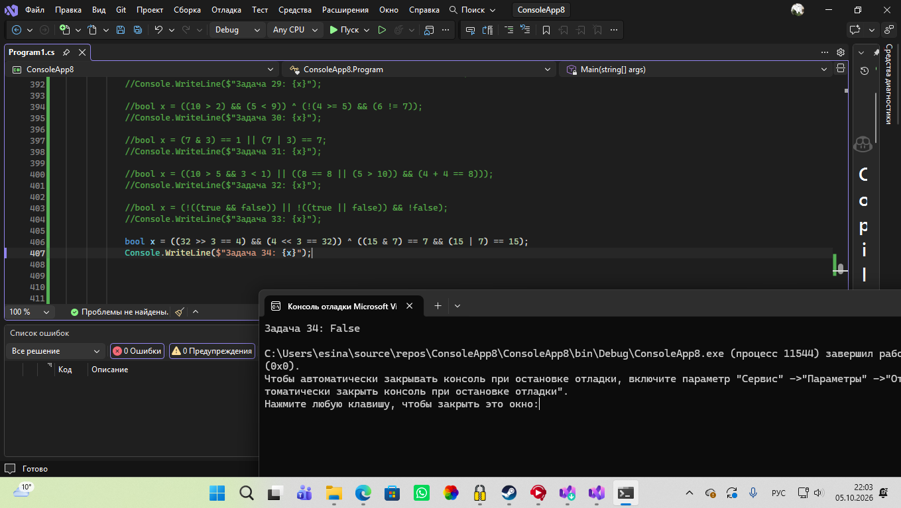 
</picture>

```csharp
using System;
using System.Collections.Generic;
using System.Linq;
using System.Text;
using System.Threading.Tasks;

namespace ConsoleApp1
{
    internal class Program
    {
        static void Main(string[] args)
        {
            bool res = ((32 >> 3 == 4) && (4 << 3 == 32)) ^ ((15 & 7) == 7 && (15 | 7) == 15);
            Console.WriteLine($"{res}");
        }
    }
}
```

### Задание 35:( (5 > 3 ? (2 > 1 ? true : false) : false) && !( (10 > 20) || (30 < 15) ) )


<picture> 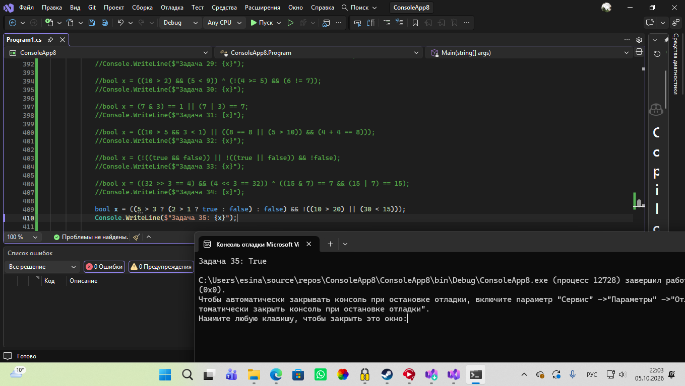 
</picture>

```csharp
using System;
using System.Collections.Generic;
using System.Linq;
using System.Text;
using System.Threading.Tasks;

namespace ConsoleApp1
{
    internal class Program
    {
        static void Main(string[] args)
        {
            bool res = ((5 > 3 ? (2 > 1 ? true : false) : false) && !((10 > 20) || (30 < 15)));
            Console.WriteLine($"{res}");
        }
    }
}
```

